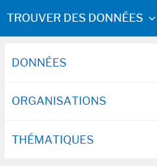

===================
Espace consultation
===================

DataSud est un catalogue ouvert à tous : 
https://trouver.datasud.fr 

Les consultations des données ouvertes, géographiques et intelligentes sont libres sur DataSud. Vous pouvez parcourir le catalogue, rechercher des jeux de données et télécharger des ressources dans différents format de fichier.

Ceci ne concerne pas les données diffusées sur accès retreints, pour lesquelles les producteurs ont volontairement limité leur téléchargement à certains utilisateurs. Toutefois ces jeux de données apparaissent au catalogue général pour porter à connaissance des publics l'existence de ces données. Pour les consulter il faut en faire la demande directement au producteur.

-------------------------------------------
Rechercher des données sur DataSud
-------------------------------------------

Pour de meilleurs résultats, DataSud permet de « filtrer » les données, d'effectuer des recherches par thématique, selon la fréquence de mise à jour, par format ou uniquement les jeux de données associés à une organisation.

L’ensemble de ces « filtres » peuvent être cumulés pour affiner les résultats avec un moteur de recherche “textuel”

Il n'y a pas d'inscription préalable pour accéder aux jeux de données et aux ressources diffusés en "Open Data". 

Dans le respect des conditions générales d’utilisation de DataSUD, chaque jeux de données est publié avec une licence, choisie par le producteur de la donnée, dans le but de définir les conditions de leur réutilisation

Voir le passage sur les licences: licences ouvertes, licence odbl, etc...

