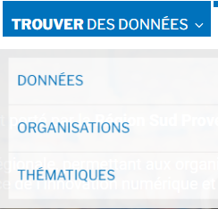

===================
Espace consultation
===================

DataSud est un catalogue ouvert à tous : 
https://trouver.datasud.fr 

Les consultations des données ouvertes, géographiques et intelligentes sont libres sur DataSud. Vous pouvez parcourir le catalogue, rechercher des jeux de données et télécharger des ressources dans différents format de fichier.

Ceci ne concerne pas les données diffusées sur accès retreints, pour lesquelles les producteurs ont volontairement limité leur téléchargement à certains utilisateurs. Toutefois ces jeux de données apparaissent au catalogue général pour porter à connaissance des publics l'existence de ces données. Pour les consulter il faut en faire la demande directement au producteur.

-------------------------------------------
Rechercher des données sur DataSud
-------------------------------------------

Pour de meilleurs résultats, DataSud permet de « filtrer » les données, d'effectuer des recherches par thématique, selon la fréquence de mise à jour, par format ou uniquement les jeux de données associés à une organisation.

L’ensemble de ces « filtres » peuvent être cumulés pour affiner les résultats avec un moteur de recherche “textuel”

- *>> Catalogue de données DataSud* https://trouver.datasud.fr/dataset

- *>> Liste des organisations DataSud* https://trouver.datasud.fr/organization

- *>> Liste des thématiques DataSud* https://trouverc.datasud.fr/group

- *>> Liste des réutilisations recensées à partir des données publiées DataSud* https://trouver.datasud.fr/showcase

Il n'y a pas d'inscription préalable pour accéder aux jeux de données et aux ressources diffusés en "Open Data". 

Dans le respect des conditions générales d’utilisation de DataSud, chaque jeux de données est publié avec une licence ( licences ouvertes, licence odbl, etc...), choisie par le producteur de la donnée, dans le but de définir les conditions de leur réutilisation. 

`« Voir le passage sur le Cadre légal et réglementaire » <https://datasud.readthedocs.io/fr/latest/cadre_legal.html#>`_

Si vous recherchez un jeu de donnée qui ne figure pas au catalogue de DataSud, vous pouvez utiliser le service de "demande de données" Toute demande sera étudiée et une réponse vous sera apportée. Nous relayerons le cas échéant votre demande à la collectivité ou à l'organisme concerné.

  **Vous pouvez déposer une demande d'accès à un document administratif ou à un jeu de données relatif au territoire régional à l'adresse suivante : https://www.datasud.fr/demande-de-donnees**   

`« Voir le passage sur la demande de documents administratif » <https://datasud.readthedocs.io/fr/latest/cadre_legal.html#faire-une-demande-d-acces-a-un-document-administratif-ou-a-des-donnees>`_
