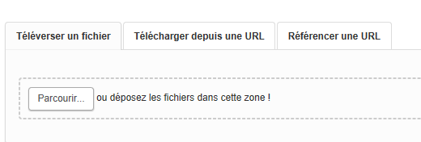
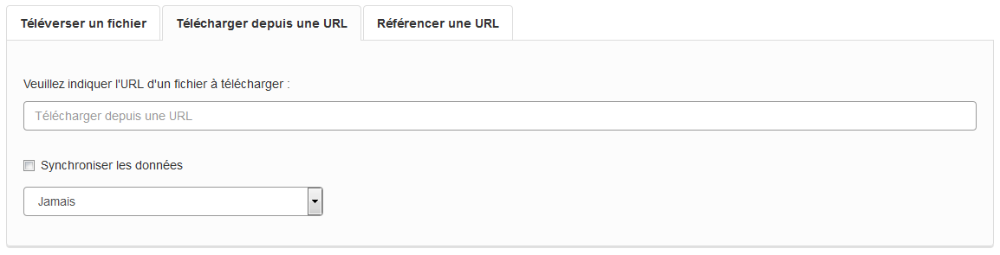

====================
Espace contributeurs
====================

Ce guide est destiné aux producteurs de données, déjà inscrit en tant qu'Utilisateurs https://publier.datasud.fr/ 
(voir Espace Utilisateur) et souhaitant contribuer à l'enrichissement des publications sur la plateforme : 

.. note:: Toute personne, morale ou physique, publique ou privée, producteur de données publiques ou privées peut les publier sur la DataSud, sous reserve d'accepter les « conditions d’utilisation » et de respecter la réglementation sur les données à caractères personnelles.

-----------------------------------------------------------------------------
Devenir Contributeur et Référent pour une organisation
-----------------------------------------------------------------------------

Les organisations sont le plus souvent des personnes morales (autorités administratives, associations, entreprises) ou également des groupes informels.

.. note:: **La création d'une nouvelle organisation doit nécessairement être effectuée au moment de l'inscription individuelle de l'Utilisateur**. 

Si l'organisation est déjà existante sur DataSud, l'Utilisateur peut demander et obtenir le statut de Contributeur ou Référent après son inscription.

Les demandes de statut de Contributeur ou de Référent sont soumises à la validation des Administrateurs de la plateforme.
Il faut donc patienter un peu. 

Par défaut, un Utilisateur qui s'inscrit avec un email personnel (gmail, ymail, hotmail,...) et dont le nom de domaine ne peut correspondre à l'organisation pour laquelle il demande de contribuer, ne peut se rattacher, contribuer ou devenir référent d'une Organisation.

*Les Administrateurs de la Plateforme se réservent la possibilité de révoquer une inscription, un statut de Contributeur ou de Référent, sans avis préalable.*

**Un Contributeur dispose des fonctionnalités suivantes :**

* il peut publier un jeu de données et y ajouter des ressources, sous la forme d’un fichier téléchargeable, d’un lien URL ou d’une API,
* il peut accorder le niveau d'accès aux ressources et jeux de données qu'il a crée pour son organisation : il peut décider de les rendre accessible à tous, ou uniquement aux Utilisateurs inscrits, ou bien les restreindre à un Utilisateur inscrit, une Organisation ou uniquement sa propre Organisation propriétaire du Jeu de données.

.. image:: CaptureDataSudFirstConnect.PNG

.. image:: devenir_contributeur.png

**Un Référent des données de l'Organisation, à laquelle il appartient, dispose des fonctionnalités suivantes :**

* Il peut éditer ou supprimer un jeu de données créé et publié par un autre Contributeur de l'Organisation,
* Il peut accorder le niveau d'accès aux ressources et jeux de données de toutes les publications de son Organisation,
* Il peut autoriser ou supprimer le statut de Contributeur aux Utilisateurs,
* Il recoit des notifications lorsque des modifications ont été apportées aux jeux de données et ressources de l'Organisation à laquelle il appartient.

--------------------------
Publier un jeu de données
--------------------------

* Pour publier un jeu de donner le Contributeur se connecte sur DataSud https://publier.datasud.fr

**La publication se fait en deux étapes successives:** 

Tout d'abord on renseigne les métadonnées servant à définir ou décrire le jeu de données qui sera publié, quel que soit son support, puis on ajoute des jeux de données brutes ou des ressources complémentaires.

^^^^^^^^^^^^^^^^^^^^^^^^^^^^^^^^^^^^^^^^^^^^^^^^^^
Etape n°1 : Renseigner les métadonnées
^^^^^^^^^^^^^^^^^^^^^^^^^^^^^^^^^^^^^^^^^^^^^^^^^^

.. image:: CaptureDataSudAddDataset.PNG

**Les métadonnées obligatoires sont les suivantes :**

- Titre
- Organisation à laquelle est rattaché ce jeu de données
- Descriptif
- Licence
- Dates (par défaut)

.. note:: le descriptif est un champ incontournable pour garantir une bonne réutilisation, car une donnée bien décrite est une donnée bien réutilisée ! ::

**Les métadonnées facultatives sont les suivantes :**

- Thématiques
- Mots-clés
- Type de données
- Meta-données INSPIRE
- Fréquence de mise à jour
- Couverture régionale

^^^^^^^^^^^^^^^^^^^^^^^^^^^^^^^^^^^^^^^^^^^^^^^^^^
Etape n°2 : Publier une ressource
^^^^^^^^^^^^^^^^^^^^^^^^^^^^^^^^^^^^^^^^^^^^^^^^^^

Il existe trois manières différentes d'ajouter un jeu de données :

**1.	Téléverser manuellement un fichier depuis votre poste local:** 

Dans ce cas la ressource s’ajoute dans l’entrepôt de données DataSud;
Le nom de votre fichier est automatiquement recopié, cependant il est possible de modifier manuellement le nommage de ce jeu de donnée.

Le format du fichier est automatiquement reconnu par DataSud.

**2.	Télécharger depuis une URL en indiquant une URL de téléchargement du jeu de donnée:**

Dans ce cas, Datasud va télécharger la ressource pour l'ajouter dans l’entrepôt de données; 

Ce mode de publication permet de synchroniser la ressource distante, selon une périodicité régulière à indiquer : 

* Quotidienne (tous les jours à minuit)
* Hebdomadaire (tous les lundis)
* Bimensuelle (1er et 15 de chaque mois)
* Trimestrielle ( 1er des mois de Janvier, Avril, Juillet et  Octobre)
* Annuelle (1er Janvier)

Par exemple, un fichier transport.zip peut-être synchronisé sur DataSud directement grace à son URL de téléchargement.

.. note:: Quelques précautions à prendre pour que la synchronisation s'active correctement : 

* le nom de votre fichier doit avoir **exactement** le même nommage de fichier pour toute la synchronisation : si un script modifie le nom du fichier (pour rajouter une date ou autre par exemple), la synchronisation ne fonctionnera pas.

* votre fichier doit être accessible via une URL fixe : évitez les liens temporaires.::

En cas d'erreur, les Administrateurs de DATASUD se chargeront de vous indiquer que la synchronisation ne fonctionne pas ou plus.

**3.	Référencer une URL:**

Dans ce cas, la ressource n'est pas téléchargée dans DataSud et vous indiquez précisement l'adresse URL de téléchargement de la donnée. qui reste hebergée chez son producteur. 
Cette donnée apparait au catalogue de DataSud mais elle n'est pas hébergée dans son entrepot.

----------------------------------------------
Editer la page d'une Organisation
----------------------------------------------

Pour editer la page de son organisation, le Contributeur clique sur l'onglet ORGANISATION dans son espace d'administration. 

.. image:: les_organisations.PNG

--------------------------------------------------
Datastore et données intelligentes
--------------------------------------------------

Datasud propose un **datastore**, c'est à dire un entrepôt de données qui offre un certain niveau de **services dits "intelligents" sur les données (pour l'instant) tabulaires aux formats CSV et XLS**. L'indexation de vos données dans le datastore permet notamment de transformer vos données en données semi-structurées et de :

- visualiser et parcourir ces dernières,
- les filtrer par champs.
- créer des datavisualisations simples,
- automatiser l'accès par API.

Permettre l'accès à vos données par interface de programmation est une condition nécessaire pour massifier, industrialiser les usages qui peuvent être fait de ces dernières. C'est également une exigence de la loi république numérique de diffuser dans un format ouvert et interprétable par une machine. Sur Datasud, le format CSV est le format pivot à privilégier pour transformer vos données tabulaires en données semi-structurées dites "intelligentes". 

**Dans la version bêta de DataSud cette mécanique est encore sensible.**

**Vos jeux de données doivent être préparés pour être proprement indexés dans le datastore :**

- Le format CSV à priviliégier doit privilégié avec un ; comme séparateur / délimiteur.
- Idéalement, passez tous vos jeux de données en UTF-8. Notepad++ fait cela très bien.
- Idéalement, exportez vos tableurs favoris (Microsoft, Libre et Open Office) au format CSV.
- Restreindre vos titres de colonnes à moins de 62 caractères.
- En théorie les caractères spéciaux ('\:.,( -') sont acceptés, les éviter dans les titres c'est beaucoup mieux.
- Harmoniser le type de vos données (et oui vos données sont typées) : en effet si une colonne ne comporte que des chiffres, le Datastore autodéterminera le type de cette colonne comme étant un nombre. Or si une valeur contient l'entrée N/A, le datastore va générer une erreur. Pour eviter les erreurs de type, une solution amont à l'indexation consiste à soit corriger les erreurs, soit transformer toutes vos cellules en cellules au format TEXTE. Cela n'est pas satisfaisant, mais ca fonctionne.

Utilisez des outils appropriés pour nettoyer vos données :

- La méthode infolabs, produire un CSV de qualité : http://infolabs.io/prod-csv 
- Les outils http://csvlint.io/ https://goodtables.io/ ou http://openrefine.org/

**Attention :**

- EXCEL : seule la dernière feuille de calcul (ou onglet) est indexée dans le datastore. Il est donc nécessaire de déplacer la feuille de calcul qui contient les données que vous voulez indexer dans le datastore en dernière place de votre classeur.

- EXCEL : si vous ne voulez pas indexer vos données dans le datastore (pour plein de bonnes et mauvaises raisons), il suffit d'ajouter une feuille de calcul vide en dernière, à la fin du classeur. 

- ERREUR : En cas d'erreur supprimez complètement la ressource associée au jeu de données et ajoutez en une nouvelle.

- Les données indexées dans le datastore sont ensuite "requetables" directement à travers l'API à travers une série de fonctionnalités puissantes. Présentation de l'API CKan :

http://datasud.readthedocs.io/fr/latest/developpeurs/index.html#service-api-ckan

-----------------------------------------------------
Géolocalisation de vos données tabulaires (XLS et CSV)
------------------------------------------------------

Une carte peut automatiquement être générée à partir de vos données tabulaires geolocalisées. Pour cela vous devez intulité vos deux colonnes "latitude" et "longitude".

Projections : en cours de rédaction.

--------------------------------------------------
Amélioration des champs descriptifs avec Markdown
--------------------------------------------------

Pour les champs descriptifs de vos jeux de données et de vos ressources et de vos organisations vous pouvez utiliser la syntaxe Markdown.

Voici quelques exemples de syntaxe Markdown.

Cette liste n'est pas exhaustive.

=== Formatage ===

Mettre du texte en italique ::

    *quelques mots*

*quelques mots*

Mettre du texte en gras ::

    **plus important**

**plus important**

Pour mettre du code dans le texte::

    ``Mon code``

``Mon code``

=== Listes ===

Sauter une ligne avant le début de la liste.

Pour créer une liste non ordonnée ::

   * Pommes
   * Poires
   

* Pommes
* Poires  

=== Image ====

Vous pouvez afficher une image dans vos descriptifs. Attention, la taille n'est pas paramétrable et l'image doit déjà être disponible en ligne quelque part ::

   .. image:: CaptureDataSudConnect.PNG

.. image:: CaptureDataSudConnect.PNG

=== Liens ===

Pour créer des liens ::

   [texte du lien](url_du_lien "texte pour le titre, facultatif")
   https://trouver.datasud.fr (automatique si mon url commence par http ou https).

[Trouver des données sur Datasud.fr](https://trouver.datasud.fr)

 
=== Aller plus loin ===

https://fr.wikipedia.org/wiki/Markdown

https://guides.github.com/features/mastering-markdown/

https://guides.github.com/pdfs/markdown-cheatsheet-online.pdf

-------------------------------------------------------
Renseigner les métadonnées INSPIRE
-------------------------------------------------------

Cette partie de la documentation est en cours de rédaction.

