====================
Espace contributeurs
====================

Ce guide est destiné aux producteurs de données, déjà inscrit en tant qu'Utilisateurs https://publier.datasud.fr/ et souhaitant contribuer à l'enrichissement des publications sur la plateforme.
`« voir la documentation sur les Utilisateurs » <https://datasud.readthedocs.io/fr/latest/utilisateurs.html/>`_ 

.. note:: Toute personne, morale ou physique, publique ou privée, producteur de données publiques ou privées peut les publier sur la DataSud, sous reserve d'accepter les « conditions d’utilisation » et de respecter la réglementation sur les données à caractères personnelles.

--------------------------------------------------------
Devenir Contributeur et Référent pour une organisation
--------------------------------------------------------

Les organisations sont le plus souvent des personnes morales (autorités administratives, associations, entreprises) ou également des groupes informels.

.. note:: **La création d'une nouvelle organisation peut-être effectuée soit au moment de votre inscription comme utilisateur de DataSud, soit après la validation de votre profil Utilisateur par les Administrateurs de DataSud. Les demandes de statut de Contributeur ou de Référent sont soumises à la validation des Administrateurs. Il faut donc patienter un peu!** 

.. image:: DataSudFirstConnect.PNG

.. image:: DemandeOrga.PNG

.. note:: **Par défaut, un Utilisateur qui s'inscrit avec un email personnel (gmail, ymail, hotmail,...) et dont le nom de domaine ne peut correspondre à l'organisation pour laquelle il demande de contribuer, ne peut se rattacher, contribuer ou devenir référent d'une Organisation**

*Les Administrateurs de la Plateforme se réservent la possibilité de révoquer une inscription, une organisation, un statut de Contributeur ou de Référent, sans avis préalable.*

**Un Contributeur dispose des fonctionnalités suivantes :**

* Il peut publier un jeu de données et y ajouter des ressources, sous la forme d’un fichier téléchargeable, d’un lien URL ou d’une API,
* Il peut accorder le niveau d'accès aux ressources et jeux de données qu'il a crée pour son organisation : soit décider de les rendre accessible à tous, soit en restreindre l'accès uniquement à un ou plusieurs Utilisateurs inscrits ou bien à une Organisation choisie comme sa propre Organisation propriétaire du Jeu de données.

**Un Référent des données de l'Organisation, à laquelle il appartient, dispose des fonctionnalités suivantes :**

* Il peut éditer ou supprimer un jeu de données créé et publié par un autre Contributeur de l'Organisation,
* Il peut accorder le niveau d'accès aux ressources et jeux de données de toutes les publications de son Organisation,
* Il peut autoriser ou supprimer le statut de Contributeur aux Utilisateurs,
* Il recoit des notifications lorsque des modifications ont été apportées aux jeux de données et ressources de l'Organisation à laquelle il appartient.

-----------------------
Créer une Organisation
-----------------------

Toute demande de création d'une organisation est soumise à l'administrateur du site pour validation

.. image:: DataSudAjoutOrga.PNG

La dénomination sociale est obligatoire

.. image:: Creation_orga1.PNG

La description est facultative mais fortement conseillée, d'une part pour permettre de qualifier l'Organisation et sa démarche en matière d'ouverture des données publiques et géographiques et d'autre part pour permettre l'implementation automatique d'une page web spécifique à propos de l'organisation.

.. image:: Creation_orga2.PNG

-----------------------------------
Editer la page d'une Organisation
-----------------------------------

Pour éditer la page de son organisation, le Contributeur clique sur l'onglet ORGANISATIONS dans son espace d'administration. 

.. image:: Onglet_organisation.PNG

La première fois que le contributeur édite la page de son organisation, il lui sera demandé de définir le territoire de compétence de l'organisation. La création de ce territoire de compétences permet de bénéficier de fonctionnalités spatiales supplémentaires dans DataSud. Cette demande est traitée par un administrateur du CRIGE.

.. image:: Territoire_competence.PNG

----------------------------------------
Publier des données (publier.datasud.fr)
----------------------------------------

---------------------------------------------------
Tableau de bord des datasets et ressources publiées
---------------------------------------------------

Depuis l'onglet "Jeux de données", tous les utilisateurs inscrits accèdent à un dashboard des datasets qu'ils publient.

* Le sous-onglet « Mes jeux de données » présente les datasets publiés par l’utilisateur, toutes organisations confondues.
* Le sous-onglet « Tous les jeux de données » présente à l'utilisateur tous les jeux de données qu'il a publié ainsi que tous les jeux de données publiés pour les organisations dont il est le référent.
* Les trois sous-onglets suivants "Jeux de données moissonnés CKAN", "Jeux de données moissonnés CSW" et "Jeux de données moissonnés DCAT" présente à l'utilisateur les jeux de données issus de moissonnages de catalogues distants.

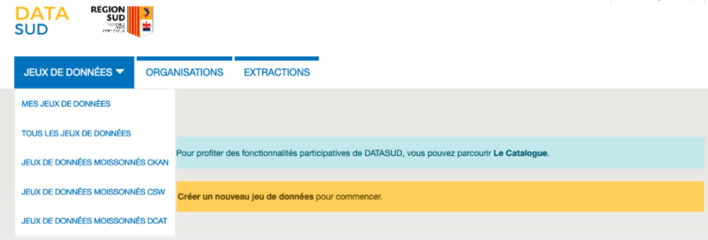

En sélectionnant un jeu de données, l'utilisateur peut :

* le supprimer,
* éditer le jeu de données, les ressources associées ou la fiche de métadonnées Inspire,
* ouvrir le dataset dans le catalogue CKAN.

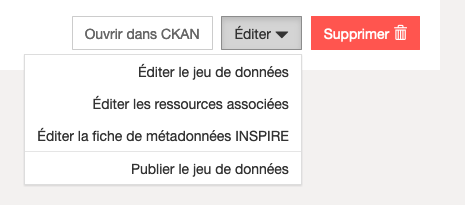

-------------------------
Publier un jeu de données 
-------------------------

* Pour publier un jeu de donner le Contributeur se connecte avec son identifiant et mot de passe sur https://publier.datasud.fr

.. image:: InscriptionDataSud.PNG

**La publication se fait en deux étapes successives:** 

Tout d'abord on renseigne les métadonnées servant à définir ou décrire le jeu de données qui sera publié, puis on ajoute des jeux de données brutes ou des ressources complémentaires.

^^^^^^^^^^^^^^^^^^^^^^^^^^^^^^^^^^^^^^^^^^^^^^^^^^
Etape n°1 : Renseigner les métadonnées
^^^^^^^^^^^^^^^^^^^^^^^^^^^^^^^^^^^^^^^^^^^^^^^^^^

.. image:: Edit_newdataset1.PNG

.. note:: De nombreux mots-clés sont déjà répertoriés dans la base. Ils apparaissent dans une liste déroulante lorsque vous saisissez les premières lettres du mot. Mieux vaut choisir un mot clés existant, plutot que d'en choisir un nouveau afin de permettre de relier votre jeu de donnée à d'autres jeux similaires inscrits au catalogue de DataSud.

.. image:: Edit_newdataset2.PNG

.. image:: Edit_newdataset3.PNG

**Les métadonnées obligatoires sont les suivantes :**

- Titre
- Organisation à laquelle est rattaché ce jeu de données
- Descriptif  : C'est un champ incontournable pour garantir une bonne réutilisation, car une donnée bien décrite est une donnée bien réutilisée !
- Dates de création, de dernière modification et de publication : la valeur par défaut indique la date du jour et la date de modification se met à jour automatiquement lorsque vous enregistrez des modifications sur les ressources.
- Licence : Selectionner une licence parmi celles qui sont proposées: Creative Commons attribution 4.0; Licence ouverte V2.0; Creative Commons cc-by-nc-nd 3.0, Open data base Licence V1.0 ou une Licence Spécifique.

**Les métadonnées facultatives sont les suivantes :**

- Illustration : le nom de l'image que vous souhaitez mettre en illustration du jeu de donnée ne doit pas contenir d'accent. le format de l'illustration peut-être du .Jpg ou .png;
- Catégories : sélectionnez dans la liste une ou plusieurs thématiques proposées correspondant à la/ les catégories associées au jeu de donnée;
- Mots-clés : privilégiez les mots clés écrits au singulier et en minuscule;
- Fréquence de mise à jour : à choisir dans la liste déroulante "Lorsque nécessaire" ; "Non planifiée"; "Irrégulière"; "Continue"; "Temps réel"; "Journalière"; "Hebdomadaire"; "Bi-mensuelle"; "Mensuelle"; "Trimestrielle"; "Bi-annuelle"; "Annuelle"; "Inconnue".
- Type de données : Données ouvertes ( correspond aux données statistiques ou tout autre jeu de donnée ne contenant pas de composante géographique; Données intelligentes ( voir le passage ci dessous au sujet du  `« Datastore » <https://datasud.readthedocs.io/fr/latest/contributeurs.html#datastore-et-donnees-intelligentes>`_   ; Données géographiques ( avec des cooordonnées géographique de géolocalisation ) 
- Meta-données INSPIRE
- Fréquence de mise à jour
- Couverture régionale

^^^^^^^^^^^^^^^^^^^^^^^^^^^^^^^^^^^^^^^^^^^^^^^^^^
Etape n°2 : Publier une ressource
^^^^^^^^^^^^^^^^^^^^^^^^^^^^^^^^^^^^^^^^^^^^^^^^^^

Il existe quatre manières différentes d'ajouter un jeu de données :

**1.	Téléverser manuellement un fichier depuis votre poste local:** 

A l'aide du bouton Parcourir, vous pouvez déposer le fichier qui s’ajoute dans l’entrepôt de données DataSud;
 
.. image:: Upload_ressources.PNG

Le **Titre** de votre fichier est automatiquement recopié, mais il est possible de modifier manuellement le nommage de ce jeu de donnée.

.. image:: Upload_ressources1.PNG

Le format du fichier est automatiquement reconnu par DataSud.
il faut préciser si le jeu de donnée est disponible en tant que Données brutes ou si c'est une documentation associée au jeu de donnée pour permettre aux visiteurs de DataSud d'avoir des informations complémentaires ( plaquettes de communications, affiches, photographie, site internet....)

**2.	Télécharger un jeu de donnée depuis une URL de téléchargement :**

Dans ce cas, Datasud va télécharger la ressource pour l'ajouter dans l’entrepôt de données; 

.. image:: Upload_ressources_URL.PNG

Ce mode de publication permet de synchroniser la ressource distante, selon une périodicité régulière à indiquer : 

* Jamais
* Quotidienne (tous les jours à minuit)
* Hebdomadaire (tous les lundis)
* Bimensuelle (1er et 15 de chaque mois)
* Trimestrielle ( 1er des mois de Janvier, Avril, Juillet et  Octobre)
* Annuelle (1er Janvier)

Par exemple, un fichier transport.zip peut-être synchronisé sur DataSud directement grace à son URL de téléchargement.

.. note:: Quelques précautions à prendre pour que la synchronisation s'active correctement : 

* le nom de votre fichier doit avoir **exactement** le même nommage de fichier pour toute la synchronisation : si un script modifie le nom du fichier (pour rajouter une date ou autre par exemple), la synchronisation ne fonctionnera pas.

* votre fichier doit être accessible via une URL fixe : évitez les liens temporaires.::

En cas d'erreur, les Administrateurs de DATASUD se chargeront de vous indiquer que la synchronisation ne fonctionne pas ou plus.

**3.	Référencer une URL:**

Dans ce cas, la ressource n'est pas téléchargée dans DataSud et vous indiquez précisement l'adresse URL de téléchargement de la donnée qui reste hebergée chez son producteur. 
Cette donnée apparait au catalogue de DataSud mais elle n'est pas hébergée dans son entrepot.

.. image:: Upload_ressources_ref_URL.PNG

**4.	Dépot sFTP:**

Le programme sftp apporte une interface similaire au programme ftp qui permet de publier des fichiers à distance. 
Pour vous connecter à votre dépôt Sftp et déposer un fichier vous pouvez le faire avec un logiciel SSH, en voici quelques-uns :

* Filezilla (The free FTP solution https://filezilla-project.org/)
* Putty ( 0.75 pour Windows - Télécharger sur https://putty.fr.uptodown.com/windows
*	mobaXterm (MobaXterm free Xserver and tabbed SSH client for Windows sur https://mobaxterm.mobatek.net/)

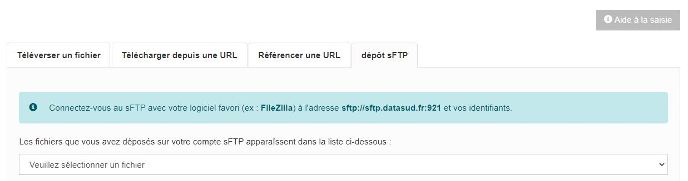

Paramètre de connexion : 

* L'adresse de connexion est : sftp://sftp.datasud.fr
* Le port est le : 921
* Les utilisateurs doivent utiliser leur login/mdp de DataSud pour se connecter et accéder à leur espace
* Une fois connecté, vous avez accès à votre espace de dépôt sFTP et vous pouvez y déposer des fichiers, 
* puis vous pouvez déposer directement sur DataSud les jeux de données depuis votre espace sFTP

.. note:: Il peut arriver que la connexion au serveur SFTP ne fonctionne pas lorsque le Proxy de votre organisation bloque l'accès au compte SFTP; Veuillez pour cela tester la connexion à partir d'un autre point d'accès internet sans Proxy ( depuis un smartphone ou une connexion internet personnelle).

^^^^^^^^^^^^^^^^^^^^^^^^^^^^^^^^^^^
Restriction d'accès des ressources
^^^^^^^^^^^^^^^^^^^^^^^^^^^^^^^^^^^

Il est possible de restreindre l’accès des ressources publiées. Dès qu'une modification est enregistrée sur la ressource concernée, une notification est envoyée aux utilisateurs pour lesquels l'accès est accordé. 

Le contributeur peut choisir plusieurs types de restrictions :

* à un ou plusieurs organismes (à choisir dans une liste déroulante) : dans ce cas seuls les utilisateurs rattachés à ces organismes pourront accéder à la ressource.
* à une liste d’utilisateur inscrits sur la plateforme (à choisir dans une liste déroulante).
* à tous les utilisateurs possédant un compte.
* à tous les utilisateurs « partenaires ».

.. note:: Le mail renseigné dans le champ "Email du diffuseur" est utilisé pour la réception des demandes d'accès aux données sécurisées. Aussi, les contributeurs peuvent indiquer une adresse mail particulière pour être informés de ces demandes d'accès.

---------------------------------------------
Publication en mode privé d'un jeu de données
---------------------------------------------

Il est possible de publier un jeu de données en mode « Privé » : dans ce cas, seuls les administrateurs de la plateforme ainsi que les utilisateurs rattachés à l’organisation qui publie pourront accéder au jeu de données dans le catalogue CKAN.
Ce mode de publication peut être considéré comme un mode brouillon et permet de vérifier et valider sa publication dans le catalogue.

------------------------------------------------
Mettre à jour un jeu de données ou une ressource
------------------------------------------------

Les données publiées peuvent être mises à jour après leur publication, que la modification porte sur un jeu données dans son ensemble, ou sur l’une des ressources qu’il contient  (Données brutes ou ressources associées).

L'actualisation d’une ressource existante permet d’en mettre à jour le contenu sans changer l’emplacement qui lui est assigné, c’est-à-dire son lien hypertexte (aussi appelé URL). Le fait d’actualiser une ressource (plutôt que de la supprimer et d'en créer ensuite une nouvelle) permet de conserver l’historique des téléchargements de cette ressource. Cela évite aussi de créer des liens rompus sur Internet, qui meneront à une erreur HTTP 404, vu que la page web n'existera plus et sera introuvable par le serveur.

-----------------------------------------------------
Supprimer un ensemble de donnée et / ou une ressource
-----------------------------------------------------

Aller sur le site https://publier.datasud.fr/ et rechercher vos jeux de données; 

Il est possible de supprimer un ensemble de données ( Dataset ) comprenant les metadonnées; ou seulement les ressources et fichiers brutes associés à un ensemble de données.
Pour cela selectionner l'ensemble de données que vous souhaitez supprimer 

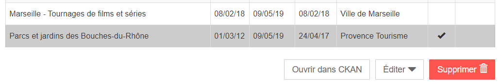

Pour confirmer, veuillez réécrire le nom du jeu de données à supprimer.

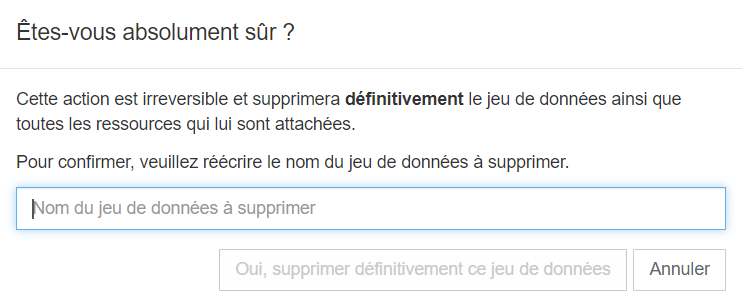

Il est recomandé de Copier le titre de l'ensemble de donnée ( Ctrl C) afin de conserver la même orthographe, puis coller ce titre dans la fenêtre qui s'affichera pour confirmer la suppression.

Attention, cette action est irreversible et supprimera définitivement le jeu de données ainsi que toutes les ressources qui lui sont attachées.

---------------------------------------------------------------
Valoriser un ensemble de donnée en déclarant leur réutilisation 
---------------------------------------------------------------

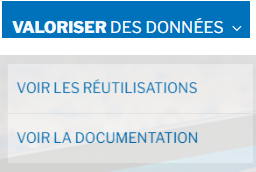

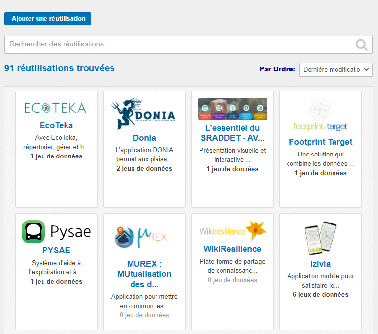

-----------------------------------
Datastore et données intelligentes
-----------------------------------

Datasud propose un **datastore**, c'est à dire un entrepôt de données qui offre des **services dits "intelligents" sur les données tabulaires aux formats CSV, XLS, GeoJSON, SHP**.

La publication des données sur Datasud, dans un format ouvert et interprétable par une machine, permet leur indexation dans le datastore afin notamment de proposer des apercus, de les filtrer par champs et de les parcourir sans utiliser de tableur dédiés.

Le format CSV est le format pivot à privilégier pour transformer vos données tabulaires en données semi-structurées dites "intelligentes" afin que le datastore génère des datavisualisations simples sous forme de grille, de graphe ou de carte.

Des données intelligentes permettent également d'en automatiser l'accès par API ( Application Programming Interface) : 
L'accessibilité des données par interface de programmation est une condition nécessaire pour massifier et industrialiser les usages qui peuvent être fait de ces dernières. 
Les données indexées dans le datastore sont ensuite "requetables" directement à travers l'API à travers une série de fonctionnalités puissantes. 
( voir la présentation de l'API CKan : http://datasud.readthedocs.io/fr/latest/developpeurs/index.html#service-api-ckan)

**Vos jeux de données doivent être préparés pour être proprement indexés dans le datastore :**

* Dans CKAN, le format CSV doit être privilégié avec une virgule  **,** comme séparateur / délimiteur.
* Idéalement, passez tous vos jeux de données en UTF-8. Pour cela le programme Notepad++ fait cela très bien.
* Idéalement, exportez vos tableurs favoris (Microsoft, Libre et Open Office) au format CSV.
* Restreindre vos titres de colonnes à moins de 62 caractères.
* Ne pas doublonner le titre d'une colonne.
* En théorie les caractères spéciaux ('\:.,( -') sont acceptés, mais c'est beaucoup mieux de les éviter dans les titres.
* Harmoniser le type de vos données (et oui vos données sont typées!) : en effet si une colonne ne comporte que des chiffres, le datastore autodéterminera le type de cette colonne comme étant un nombre. Or il suffit qu'une cellule de la colonne contienne l'entrée N/A, pour que le datastore génére une erreur. 
Pour éviter les erreurs de type, il est préférable de les corriger avant d'indexer le jeu de donnée dans DataSud ou bien de transformer la valeur des cellules en cellules au format TEXTE. Cela n'est pas satisfaisant, mais ca fonctionne.

* ERREUR : En cas d'erreur supprimez complètement la ressource associée au jeu de données et ajoutez en une nouvelle.

.. Note:: **Attention avec Excel** Lorque le fichier contient plusieurs feuillet (ou onglet), seule la dernière feuille de calcul est indexée dans le datastore. Il est donc nécessaire de déplacer la feuille de calcul contenant les données que vous souhaitez indexer dans le datastore en dernière place de votre tableur. Si vous ne voulez pas indexer vos données dans le datastore (pour plein de bonnes et mauvaises raisons), il suffit d'ajouter une feuille de calcul vide en dernière place de votre tableur.::

-----------------------------------------------------
Géolocalisation des données tabulaires (XLS et CSV)
-----------------------------------------------------

Une carte peut-être automatiquement générée à partir de vos données tabulaires geolocalisées. 
Pour cela vous devez avoir deux colonnes contenant des coordonnées géographiques ou bien une colonne géométrique (GeoJSON).

La projection utilisée est le WGS84 (EPSG : 4326).

Dans l'onglet "Grille", vous pouvez visualiser la table attributaire de vos données et vérifier qu'elles s'affichent correctement.

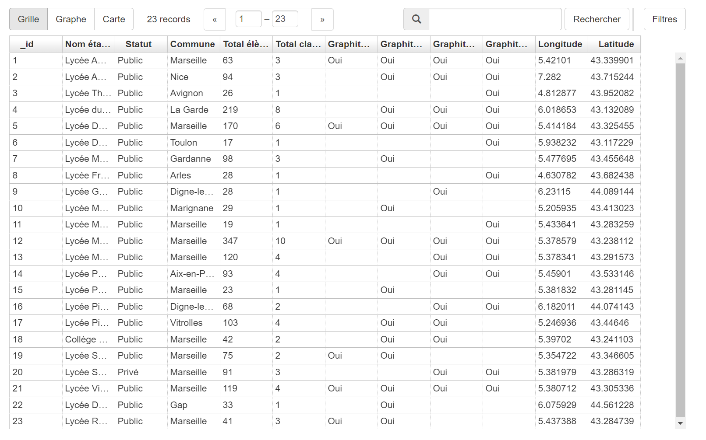

Dans l'onglet "Carte", vous pouvez visualiser vos données géolocalisées et accéder aux paramètres. 

Vous pouvez chosir quel type de coordonnées vous souhaitez utiliser entre 2 attributs de type "latitude" et "longitude" ou un seul attribut de type géométrie GeoJSON. Selon votre choix, vous allez pouvoir définir la ou les colonnes qui contiennent les informations de géolocalisation. 

L'option "Marqueurs de regroupement" vous permet de "fusionner" visuellement les données proches.

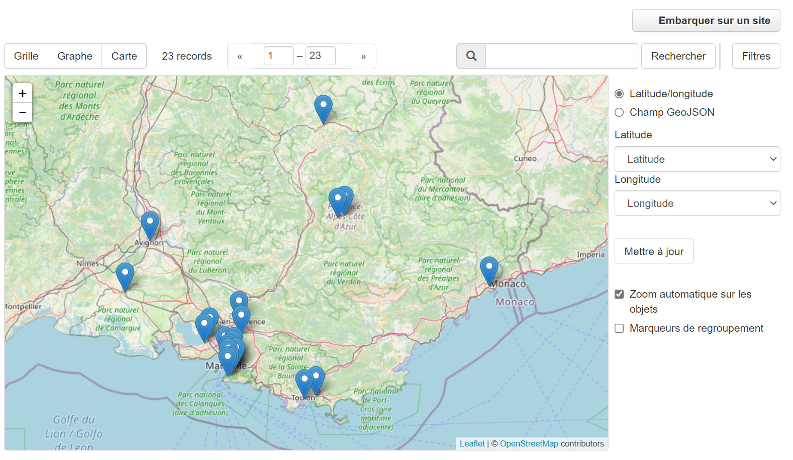

Vous pouvez également relayer cette carte sur votre site Internet en cliquant sur le bouton "Embarquer sur votre site". Il ne vous reste alors qu'à définir la taille de votre fenêtre en pixel et de copier le code sur votre site.

.. image:: csv3.PNG

Projections : en cours de rédaction.

-------------------------------------------------------
Renseigner les métadonnées INSPIRE
-------------------------------------------------------

Les utilisateurs qui le souhaitent peuvent associer une fiche de métadonnée Inspire au dataset.
Depuis l’interface d’édition du dataset, en cliquant sur « Editer la fiche de métadonnées INSPIRE » un formulaire présentant les nombreux champs requis pour ces fiches de métadonnées permet à l’utilisateur de créer une fiche dans Géonetwork.

Lors du premier enregistrement, les champs communs avec ceux du dataset sont pré-remplis et une fiche est créée dans Geonetwork. 

Par la suite, les modifications depuis ce formulaire sont reportées dans la fiche Geonetwork ainsi que dans le dataset IDGO.

---------------------------------------------
Faire remonter vos données sur Data.Gouv.fr
---------------------------------------------

La Région et Etalab ont travaillé ensemble afin de permettre la remontée automatique des catalogues de données des contributeurs de DataSud vers la plateforme nationale https://www.data.gouv.fr/fr/. Cette mécanique est aussi appelée "moissonneur" ou "passerelle".

La procédure est relativemment simple. Il suffit de la mettre en place pour une organisation contributrice de DataSud afin que ses données soient ensuite synchronisées quotidiennement sur Data.Gouv.fr

**Chaque contributeur et organisation reste souverain pour mettre en place (ou non) une synchronisation de ses données vers DataGouv.**

**Quelques précisions :**

- Seules les **métadonnées** sont synchronisées sur DataGouv. Les données restent sur DataSud (ou ailleurs en fonction de vos choix en matière d'indexation de ressources).
- Le **moissonneur ne prend pas en compte la suppression** de jeux de données. Chaque contributeur doit supprimer ses jeux de données directement sur Data.Gouv.fr
- Un compte organisation sur DataGouv expose indifféremment les jeux de données créés manuellement sur Data.Gouv.fr et les jeux de données synchronisés automatiquement depuis DataSud. Faites ainsi bien attention aux doublons et à la cohérence des jeux de données.

**Mise en place de la procédure pour configurer votre moissonneur:**

**ETAPE 1:** Chaque contributeur crée une organisation sur Data.Gouv avec un compte utilisateur en son nom. `« INSCRIPTION sur DataGouv » <https://www.data.gouv.fr/fr/login?next=https%3A%2F%2Fwww.data.gouv.fr%2Ffr%2F>`_ 
- Ce compte utilisateur doit être administrateur de l'organisation.

**ETAPE 2: création d'un point de moissonnage sur DataGouv** L'administrateur de l'organisation sur Data.gouv.fr doit déclarer un point de moissonnage depuis l’interface d’administration DataGouv. 

- En haut à droite de votre espace d'administration DataGouv, cliquez sur **+** puis Un moissonneur.

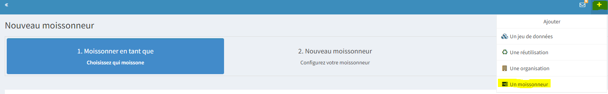

- Selectionner votre organisation "Publier en tant qu’organisation", 

.. image:: CaptureMoissonneur2.PNG

- cliquez sur Suivant en bas à droite de votre écran

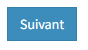

- C'est ensuite ici que vous renseignez les informations techniques de votre moissonneur:

**Nom**: Il convient d'ajouter **Mon organisation - DataSud** à votre Nom afin que le service support de Data.gouv.fr puisse l'identifier plus facilement.

**URL** racine de l’instance CKAN : https://trouver.datasud.fr

**Implementation** Choisir ckan dans le menu déroulant

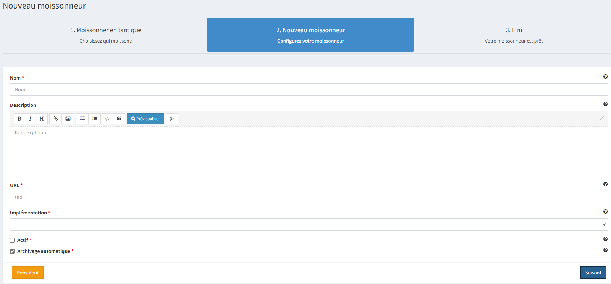

.. Note:: Il est très important de ne pas oublier d'ajouter un filtre, au risque de moissonner tout DataSud::

**Filtres -> Inclure -> Organisation -> un nom d'organisation CKAN (ajouter l'identifiant de votre organisation dans DataSud)** 

Exemple : Pour filtrer les jeux de données de DLVA, il faudra préciser dans le nom d'organisation CKAN : **durance-luberon-verdon-agglomeration** 

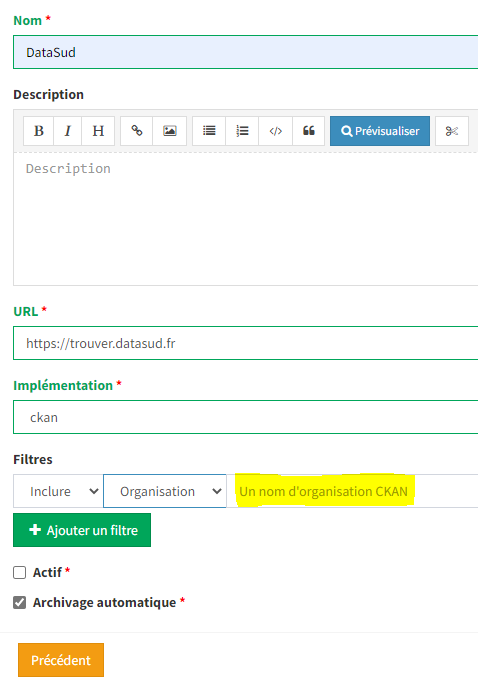

Cochez les cases **Actif** et **Archivage automatique** puis cliquez sur **ENREGISTRER**

**ETAPE 3:** Une fois créé, chaque contributeur **déclare son moissonneur aux administrateurs de DataSud en écrivant à datasud@maregionsud.fr**.

**ETAPE 4:** Etalab valide le moissonneur à la demande des administrateurs de DataSud.

**ETAPE 5:** La synchronisation du catalogue distant est faite une fois par jour (chaque nuit).

---------------------------------------------
Utiliser le service MAJIC
---------------------------------------------

Les données MAJIC 2021 sont disponibles au téléchargement pour les partenaires de la Région Provence-Alpes-Côte d’Azur sous réserve d’être ayants droit de la DGFIP.

Ce nouveau service prend en charge vos demandes de fichiers MAJIC depuis le mois de septembre 2021. 

Afin d’avoir accès aux données MAJIC, voici les étapes d’inscription :
* Inscrivez-vous sur datasud.fr ;
* Prenez connaissance des procédures et contraintes applicables sur ces données : Procédure de mise à disposition des fichiers fonciers DGFiP procedure_mad_majic.pdf  [lien pdf] ;
* Téléchargez et remplissez l’acte d’engagement clause_confidentialite_majic_latest.pdf [lien pdf] ;
* Fournir les coordonnées du DPO de votre organisme. S’il n’y en n’a pas, votre organisme doit en nommer un et faire la déclaration sur https://www.cnil.fr/fr/designation-dpo ;
* Remplissez et versez l’acte d’engagement et le récépissé de la CNIL depuis l’espace dédié de DataSUD. La livraison des données sera faite via la plateforme DataSUD dès validation de votre demande ;
* Vérifiez la validité du territoire de compétence de votre organisme.
* Télécharger vos données depuis votre espace DataSUD.

**1. Les ayants droit**

L’accès aux fichiers littéraux est limité aux collectivités territoriales, aux administrations et aux organismes chargés d’une mission de service public. La seule exception concerne le fichier des voies et lieudits (fichier FANTOIR) qui est délivré gratuitement à tout demandeur. 
Les droits sont ouverts aux : 
* Collectivités territoriales : les communes, les Départements, la Région.
* Etablissements publics de coopération intercommunale : les syndicats de communes, les communautés de communes, les communautés urbaines, les communautés d'agglomération, les syndicats d'agglomération nouvelle et les métropoles.
* Administrations d’Etat : L'Etat est représenté par les services centraux ou territoriaux de ses administrations. À cette catégorie sont rattachées certaines autorités administratives indépendantes.
* Etablissements publics : La catégorie des établissements publics comprend les organismes et établissements de droit public, financés par des fonds publics, et dont la mission est de servir l'intérêt général. On distingue deux principales catégories d'établissements publics : 
- à caractère administratif ; 
-	à caractère industriel et commercial. 
* Etablissements publics administratifs : Ce sont des personnes morales de droit public gérant une activité de service public ou parapublic sous le contrôle de l'Etat ou d'une collectivité territoriale. Parmi les établissements publics administratifs susceptibles de commander des fichiers cadastraux, il convient de citer : 
-	les associations syndicales autorisées (ASA) et les associations syndicales constituées d'office (ASCO), 
-	l'institut national de l'information géographique et forestière (IGN), 
-	l'institut national de l’origine et de la qualité (INAO), 
-	le conservatoire du littoral, 
-	les services départementaux d'incendie et de secours (SDIS), 
-	le syndicat des transports d'Ile-de-France (STIF), 
-	les chambres de commerce et d'industrie (CCI). 
* Etablissements publics industriels et commerciaux : Ce sont des personnes morales de droit public gérant une activité de service public de nature industrielle ou commerciale selon les règles de gestion d'une entreprise privée industrielle ou commerciale. Parmi les établissements publics industriels ou commerciaux susceptibles de commander des fichiers cadastraux, il convient de citer : 
-	l'office national des forêts (ONF), 
-	le réseau ferré de France (RFF), 
-	la société nationale des chemins de fer français (SNCF), 
-	les offices publics de l'habitat (OPH). 
* Groupements d’intérêt public (GIP) ou Associations loi 1901 : Ce sont des personnes morales de droit public dont les membres exercent des activités d'intérêt général à but non lucratif. 
* Sociétés publiques locales d’aménagement (SPLA) : Les sociétés publiques locales d'aménagement ont été créées par la loi n° 2006-872 du 13 juillet 2006 portant engagement national pour le logement. Dans la mesure où le capital d'une SPLA est entièrement public, où son activité est réalisée intégralement pour le compte et uniquement sur le territoire des collectivités qui en sont actionnaires, et où ses statuts prévoient un contrôle suffisant pour que l'on puisse considérer que la personne publique délégante exerce sur la société un contrôle analogue à celui qu'il exerce sur ses propres services, la SPLA peut être considérée comme un tiers habilité à recevoir les données littérales de la DGFiP. 
* Prestataires de services : La restriction tenant à l'usage interne des données ne fait toutefois pas obstacle à une utilisation des données par un prestataire de services chargé de réaliser des traitements ou d'apporter son concours pour les études mises en œuvre par le demandeur. En cas de recours à un prestataire de services, une convention doit définir précisément les traitements qui lui sont demandés. Le prestataire doit prendre les mesures de sécurité nécessaires et s’engager à ce que les informations communiquées ne soient pas conservées, utilisées ou dupliquées à d’autres fins que celles indiquées par la convention. À l’issue de sa mission, il doit détruire tous les fichiers manuels ou informatisés servant de supports aux informations saisies. 

**2. Nature des documents délivrés** 

Les fichiers fonciers standards issus de l’application MAJIC comprennent : 
* Le fichier des propriétaires 
*	Le fichier des propriétés non bâties (parcelles) 
*	Le fichier des propriétés bâties (locaux) 
*	Le fichier des propriétés divisées en lots (lots de copropriété), complément des fichiers propriétés non bâties et bâties 
*	Le fichier des liens lots-locaux, complément du fichier propriétés bâties 

Ces fichiers produits une fois par an sont disponibles au début du deuxième semestre. Les données présentent la situation existante au 1er janvier de l’année. 
Depuis 2013, la livraison des fichiers MAJIC n’inclut plus les fichiers FANTOIR. Le fichier des voies et lieux-dits ou fichier FANTOIR est librement à disposition en téléchargement sur le site http://www.collectivites-locales.gouv.fr 
 
**3. Conditions d’obtention des fichiers** 

*a. Instruction de la demande* 

La Région Provence-Alpes-Côte d’Azur se conforme aux directives de la direction régionale des finances publiques. Elle doit analyser la finalité de la demande et s'assurer en particulier que les données ne seront pas utilisées dans un but commercial (actions de publicité ou de démarchage), électoral, ou politique (envois de tracts d'une organisation ou d'un parti politique). 
Elle pourra donc être amenée à effectuer des démarches d'éclaircissement auprès des demandeurs et, le cas échéant, à rejeter les demandes qui seraient manifestement incompatibles avec la législation. 
L’accès aux données est conditionné par l’inscription gratuite sur le portail www.datasud.fr de l’organisme demandeur, depuis un compte utilisateur nominatif et désigné comme référent de l’organisation. La demande d’accès aux données se fait ensuite depuis l’onglet « MAJIC » disponible sur le site dès que l’utilisateur référent est connecté.

*b. Territoire de compétence* 

La communication des données se limite à la compétence géographique et administrative du demandeur, qui doit les utiliser à des fins strictement internes. Il convient de réaliser un examen précis de la demande au regard de ces critères. 
Si un adhérent souhaite modifier son territoire de compétence, il doit fournir une preuve de l’évolution de ce dernier, en envoyant à la Région Provence-Alpes-Côte d’Azur un document officiel comprenant les codes INSEE des communes à ajouter et/ou enlever. 

*c. Contexte de la mise à disposition des fichiers* 

La Région Provence-Alpes-Côte d’Azur, avec l’accord de la DGFIP, s’engage à distribuer aux ayants-droit les fichiers fonciers standards issus de l’application Majic. 

*d. Conformité des traitements avec la loi informatique et libertés et RGPD* 

Il est précisé que la délibération CNIL n° 2012-088 du 29 mars 2012 dispense de déclaration les traitements automatisés de données personnelles mis en œuvre aux fins de consultation des données issues de la matrice cadastrale par toute commune, groupement et organisme privé ou public chargé d'une mission de service public (J.O. du 13 mai 2012) et exempte de toute obligation déclarative ces demandeurs tant pour les fichiers fonciers que pour les cédéroms VisuDGFiP cadastre. 
Le 28 mai 2018, la mise en place du Règlement Général sur la Protection des données (RGPD) rend obsolète l'obligation déclarative auprès de la CNIL des traitements informatisés de données à caractère personnel mis en œuvre dans le cadre d'un système d'information géographique via l’autorisation unique n°1 (AU-001). 
Dorénavant il revient à l’organisme ayant-droit et recevant les données des fichiers fonciers de se mettre en conformité lui-même aux nouvelles dispositions encadrant le RGPD. Pour cela, un DPO doit être déclaré auprès de la CNIL. Plus d’information sur https://www.cnil.fr/fr/designation-dpo. 
 
*e. La procédure*

Prérequis obligatoires et règles : 
*	Votre organisme doit être inscrit sur le site www.datasud.fr,
*	Votre organisme doit être un ayant droit sur les fichiers fonciers (cf. 1. Les ayants droit). Nous contacter si vous avez un doute, 
*	Seule la personne désignée comme référente de votre organisation sera habilitée à télécharger les fichiers, 
*	Vous devez prendre connaissance de la conformité des traitements avec le RGPD, 

Etape 1 : Enregistrement de l’ayant droit sur www.datasud.fr (si ce n’est pas déjà fait)
*	Création d’un compte nominatif ; 
*	Affectation du compte à une organisation déjà existante ou création d’un nouvel organisme ;
*	Désignation du compte nominatif comme étant référent de l’organisation ;

Etape 2 : Activation de l’espace « MAJIC » 

Depuis l’onglet « MAJIC » du site datasud.fr, il faudra :
*	Télécharger l’acte d’engagement, à remplir et à signer et à nous transmettre via la boîte de dialogue dédiée ;
*	Transmettre les coordonnées du DPO de votre organisme (nom, prénom et mail). S’il n’y en n’a pas, votre organisme doit en nommer un et faire la déclaration sur https://www.cnil.fr/fr/designation-dpo ;

Etape 3 : Commande et téléchargement des fichiers 

Une fois l’espace « MAJIC » activé et les documents validés, vous pourrez, toujours depuis l’onglet « MAJIC » :
*	Visionner le territoire concerné par votre organisme ;
*	Définir le type de lot souhaité, par commune ou par territoire ;
*	Lancer l’exécution de votre demande qui sera disponible quelques minutes plus tard. Attention, le lien pour télécharger les fichiers n’est valable que 2 heures.
