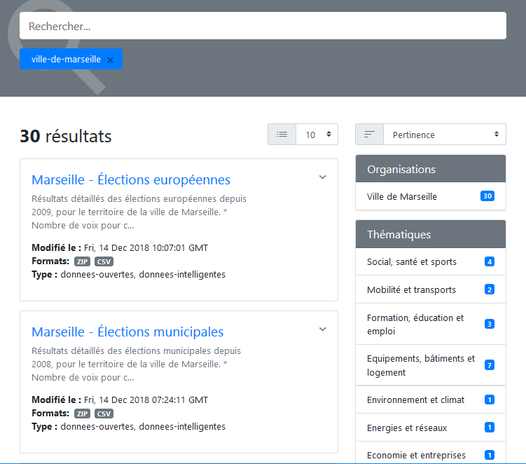

.. _action developpeurs:

-------------------------------
Espace développeurs
-------------------------------

Service API Ckan
================

Le site **https://trouver.datasud.fr** est construit à partir du système d'information OpenSource dédié à la gestion de catalogues de données `CKAN <http://www.ckan.org/>`_. 

Requêter l'API CKAN Catalogue
========

CKAN propose une API permettant d'interroger et de consulter le catalogue des données et leurs ressources. L'API permet également de requêter directement le contenu des ressources tabulaires (CSV, XLS) lorsque celles-ci ont été correctement intégrées au Datastore (http://datasud.readthedocs.io/fr/latest/producteurs.html#datastore-et-donnees-intelligentes).

Ainsi, il est par exemple possible de réaliser ce qui suit.

* Obtenir au format JSON : 

  la liste totale des jeux de données : http://trouver.datasud.fr/api/3/action/package_list

  les groupes thématiques : http://trouver.datasud.fr/api/3/action/group_list

  les mots-clés utilisés : http://trouver.datasud.fr/api/3/action/tag_list
  
  les organisations du catalogue : http://trouver.datasud.fr/api/3/action/organization_list
  
* Obtenir un flux des jeux de données récemment mis à jour :

  http://trouver.datasud.fr/api/3/action/recently_changed_packages_activity_list

* Obtenir une réprésentation détaillée d'un des objets (jeu de données, organisation, ressource), toujours au format JSON :

* Obtenir une représentation détaillée d'un jeu de données :
  https://trouver.datasud.fr/api/3/action/package_show?id=arbres-proteges-a-digne-les-bains
  
* Obtenir une représentation détaillée d'une organisation : 
  https://trouver.datasud.fr/api/3/action/organization_show?id=atmosud

* Obtenir la liste de tous les jeux de données d'une organisation : 
  https://trouver.datasud.fr/api/3/action/package_search?fq=organization:(ville-de-digne-les-bains)&rows=150

* Obtenir une liste de jeux de données "géographiques" :
  https://trouver.datasud.fr/api/3/action/package_list?datatype=donnees-geographiques
  
* Obtenier des informations sur la thématique "Environnement et Climat".
  https://trouver.datasud.fr/api/3/action/group_show?id=environnement-et-climat

* Rechercher de jeux de données à partir d'un mot clé :
  https://trouver.datasud.fr/api/3/action/package_search?q=energies

* Rechercher des jeux de données "géographiques", au format CSV, associés à la thématique Culture, patrimoine et tourisme :
  https://trouver.datasud.fr/api/3/action/package_search?fq=+res_format:CSV+datatype:donnees-geographiques+groups:culture-patrimoine-et-tourisme

Requêter l'API CKAN DATA
========

DataSud.fr permet également de requêter directement le contenu des jeux de données, ou plutôt de leurs ressources. Cette mécanique est rendue possible à travers l'interrogation de l'API de données de CKAN (API CKAN DATA).

Comme expliqué plus haut, le Datastore propose un service d'indexation des données tabulaires (CSV et XLS). L'API CKAN DATA permet d'exposer le contenu des ressources indexées dans le Datastore dont on peut ainsi interroger tout ou partie sans avoir à télécharger le jeu de données. Il est alors possible de faire des opérations de recherche sur les différents champs de données. 

* Afficher les cinq enregistrements du jeu de données des hôtels en région Provence-Alpes-Côte d'Azur :

Cette requête utilise  la méthode datastore_search de l'API de CKAN avec la notion de filtres.

``https://trouver.datasud.fr/api/3/action/datastore_search?resource_id=9723b8ba-8379-4b1f-a85c-1f0efe916ce8&limit=5``

Requête et résultats : https://bit.ly/2Lc3T12

* Trouvez toutes les entreprises de la base INFOGREFFE 2017 dont le champ ville est égal à MARSEILLE::

Cette requête utilise  la méthode datastore_search de l'API de CKAN avec la notion de filtres.

``https://trouver.datasud.fr/api/3/action/datastore_search?resource_id=9723b8ba-8379-4b1f-a85c-1f0efe916ce8&filters={"Ville":"MARSEILLE"}``

Requête et résultats : http://bit.ly/2BKn6VW

* Trouver toutes les entreprises de la base INFOGREFFE 2017 de la ville de MARSEILLE avec le code APE 6831Z, et afficher les résultats à partir du centième (série de 100 à 199) ::

Cette requête utilise la méthode datastore_search de l'API de CKAN avec la notion de filtres.

``resource_id=9723b8ba-8379-4b1f-a85c-1f0efe916ce8&filters={"Ville":"MARSEILLE","Code APE":"6831Z"}&offset=100``

Requête et résultats : http://bit.ly/2oliZId

* Production électrique régionale : trouvez les horaires ou le solaire est supérieur à 20MW (requête SQL) ::

Cette requête utilise la méthode datastore_search_sql de l'API de CKAN avec la notion de requête SQL .

``https://trouver.datasud.fr/api/3/action/datastore_search_sql?sql=SELECT from "52a8f5dd-758d-4e54-a837-8fc7ad57d378"  WHERE "Solaire (MW)" > '20' AND "Date" > '2018-07-10'``

Requête et résultats : https://bit.ly/2N8JCKn 

Documentation de l'API (catalogue et ressources) et de l'API Datastore (requête sur les ressources) en anglais :

http://docs.ckan.org/en/latest/api/
http://docs.ckan.org/en/ckan-2.7.2/maintaining/datastore.html#the-datastore-api

.. note:: le mot "package" qu'on trouve dans certaines requête et dans la documentation CKAN correspond à un jeu de donnée.

Construire une requête pour l'API
=================================

Pour appeler l'API CKAN, postez un dictionnaire JSON dans une requête HTTP POST sur l'une des URL d'API de CKAN. Les paramètres de la fonction API doivent être indiqués dans le dictionnaire JSON. CKAN retournera également sa réponse dans un dictionnaire JSON.

Une façon de publier un dictionnaire JSON sur une URL est d'utiliser le client HTTP en ligne de commande `HTTPie <http://httpie.org/>`_. Il existe également d'autres outils comme Postman. Par exemple, pour obtenir une liste des noms de tous les jeux de données du groupe ``environnment`` sur le site, installez HTTPie, puis appelez la fonction API ``group_list`` en exécutant cette commande dans un terminal::

    http http://trouver.datasud.fr/api/3/action/group_list

La réponse de CKAN ressemblera à ceci::

    {
        "help": "...",
        "result": [
            "data-explorer",
            "department-of-ricky",
            "geo-examples",
            "geothermal-data",
            "reykjavik",
            "skeenawild-conservation-trust"
        ],
        "success": true
    }

La réponse est un dictionnaire JSON avec 3 clés :

1. ``"success"``: ``true`` or ``false``.

   L'API est conçue pour retourner à chaque fois un ``200 OK`` dans le code statut de sa réponse, qu'il y ait une erreur ou non dans la requête, il est donc important de toujours vérifier la valeur de la clé ``success`` dans le dictionnaire de réponse, et si elle est à false, de vérifier la valeur de la clé ``error``.

.. note::

    S'il y a vraiment un gros problème de syntaxe dans la requête à l'API, CKAN
    pourra retourner une réponse HTTP avec un status code ``409``, ``400`` or ``500``
    (dans l'ordre croissant de gravité). Dans les prochaines versions de CKAN, il est prévu
    d'essayer de supprimer ce type de réponse pour n'avoirà la place que des retours ``200 OK``
    et utiliser les valeurs ``"success"`` et ``"error"``.

2. ``"result"``: le résultat retournée par la fonction appelée. Le type et la valeur du résultat
   dépendent de la fonction appelée. Dans le cas de la fonction ``group_list``, il s'agit d'une liste
   de chaînes, les noms de tous les jeux de données qui appartiennent au groupe.

   Si c'est une erreur qui est retournée à la requête, le dictionnaire contiendra une clé ``"error"`` 
   avec le détail de l'erreur au lieu de la clé ``"result"``. 
   Un dictionnaire de réponse contenant une erreur ressemblera à 
   ceci::

       {
           "help": "Creates a package",
           "success": false,
           "error": {
               "message": "Access denied",
               "__type": "Authorization Error"
               }
        }

3. ``"help"``: le texte de documentation de la fonction appelée.

La même requête HTTP peut être effectuée en utilisant le module Python standard ``urllib2``
avec ce code Python ::

    #!/usr/bin/env python
    import urllib2
    import urllib
    import json
    import pprint

    # Make the HTTP request.
    response = urllib2.urlopen('http://demo.ckan.org/api/3/action/group_list',
            data_string)
    assert response.code == 200

    # Use the json module to load CKAN's response into a dictionary.
    response_dict = json.loads(response.read())

    # Check the contents of the response.
    assert response_dict['success'] is True
    result = response_dict['result']
    pprint.pprint(result)

Versions de l'API
=================
Les API CKAN sont versionnées. Si vous faites une demande à une URL d'API sans
numéro de version, CKAN choisira la dernière version de l'API::

    https://trouver.datasud.fr/api/action/package_list

Vous pouvez également spécifier le numéro de version de l'API souhaité dans l'URL
que vous envoyez::

    https://trouver.datasud.fr/api/3/action/package_list

La version 3 est actuellement la seule version de l'API Action.

Nous vous recommandons de spécifier le numéro d'API dans vos demandes, car cela
garantit que votre client API continuera à fonctionner si un jour le site est mis à niveau 
vers de nouvelles versions de CKAN). 

.. _api authentication:

Authentification et clés 
========================

Certaines fonctions de l'API nécessitent une autorisation, par exemple pour ajouter ou modifier des jeux de données et des ressources). L'API utilise la même fonction d'autorisation
et la configuration en tant qu'interface web, donc si un utilisateur est autorisé à
faire quelque chose dans l'interface web, il sera autorisé à le faire via l'API.

Lorsque vous appelez une fonction de l'API nécessitant une autorisation, vous devez vous authentifier
vous-même en fournissant votre clé API avec votre requête HTTP. Pour trouver votre clé API, 
connectez-vous au site CKAN en utilisant son interface web et visitez votre profil utilisateur.

Pour fournir votre clé API dans une requête HTTP, incluez-la dans un En-tête `` Authorization`` ou `` X-CKAN-API-Key``.

Par exemple, pour demander si vous suivez actuellement l'utilisateur
`` markw`` sur demo.ckan.org en utilisant HTTPie, exécutez cette commande::

    https://trouver.datasud.fr/api/3/action/am_following_user id = markw Autorisation: XXX

(Remplacer `` XXX`` avec votre clé API.)

Par exemple, pour obtenir la liste des activités de votre tableau de bord utilisateur, on lance ce code Python ::
    request = urllib2.Request('http://trouver.datasud.fr/api/3/action/dashboard_activity_list')
    request.add_header('Authorization', 'XXX')
    response_dict = json.loads(urllib2.urlopen(request, '{}').read())

Support JSONP
=============

Pour répondre aux scripts d'autres sites qui souhaitent accéder à l'API, les données peuvent
être renvoyé au format JSONP, où les données JSON sont 'complétées' avec une fonction
call. La fonction est nommée dans le paramètre 'callback'. Par exemple:

https://trouver.datasud.fr/api/3/action/package_show?id=adur_district_spending&callback=myfunction

.. note :: Cela ne fonctionne qu'avec les requêtes GET

Marque blanche / Widget
==============

DataSud permet d'intégrer un **catalogue de données en marque blanche sur un site web externe**. Cette fonctionnalité est également intitulée 'widget'. Elle offre une solution technique pour valoriser le catalogue de données d'une organisation et plus largement de tout sous ensemble du catalogue de données DataSud filtré par une ou plusieurs facettes (organisations, thématiques, formats, licences, recherche par mot clé...).

**La marque blanche est accessible sans restriction et sans autorisation préalable à tout utilisateur, contributeur ou développeur de DataSud.** 

Techniquement, la marque blanche de DataSud passe par l'intégration de quelques lignes de code HTML à l'endroit souhaité sur une page web  externe ainsi que deux appels à un fichier Javascrit (.JS) et une feuille de style CSS (.CSS). 

La marque blanche DataSud a été développée par Neogeo Technologies. Elle est distribuée sur Gitub sous licence MIT. Le code source peut être utilisé pour afficher tout catalogue CKAN sur un site tiers. 

* Code source : 
  https://github.com/neogeo-technologies/ckan-widget 

* Licence :
  https://github.com/neogeo-technologies/ckan-widget/blob/master/LICENSE

* Les fichiers à inclure et un exemple de code HTML sont disponibles ici : 
  https://github.com/neogeo-technologies/ckan-widget/tree/master/build

* A quoi ressemble la marque blanche ?

* Exemple de code d'implémentation: ::

    <!DOCTYPE html>
    <html>
      <head>
        <meta charset="utf-8">
        <link href="./app.css" rel="stylesheet">
        <link href="./static/css/main.css" rel="stylesheet">
        <title>Catalogue CKAN</title>
      </head>

      <body>
        

      </body>

      
      
    </html>

**Paramètres d'intégration de la marque blanche :**

Le code d'inclusion html et son appel javascript permettent :

- 1/ De **charter l'interface graphique** à travers la modification de la feuilles de styles **app.css**.

- 2/ De **spécifier les facettes à filtrer** : les organisations (ckan_organizations), les thématiques (ckan_groups), les mots clés (ckan_tags) et plus généralement toute facette (ckan_facets) identifiable dans l'url des résultats d'une recherche effectuée sur DataSud.
- 3/ De **spécifier comment afficher les résultats** : tri (data_sort), nombre de résultats par page (result_page_size), et intégration d'un vignette (thumbnails_display: true).

**Exemples d'intégration :**

- Sur le site des Parcs Naturels Régionaux : 
http://geo.pnrpaca.org/geoservices/catalogue-de-donnees/

- Sur le site internet du Département des Alpes-Maritimes : 
https://www.departement06.fr/l-information-du-departement/opendata-29882.html

- Sur le site internet du la ville de Digen les Bains : 
https://www.dignelesbains.fr/coordonnees-et-horaires-de-la-mairie/open-data/

Service WMS
===========

En cours.

Service WFS
===========

En cours.

Service CSW
===========

En cours.
