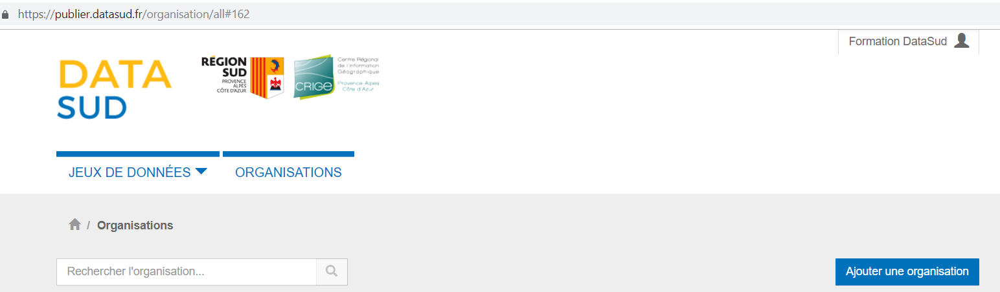

=============================
Qu'est ce qu'une organisation
=============================

Les Organisations sont le plus souvent des personnes morales (autorités administratives, associations, entreprises) ou également des groupes informels.
Il s'agit d'une entité au travers de laquelle plusieurs utilisateurs peuvent collaborer sur des jeux de données.

----------------------------------------------
Créer une Organisation
----------------------------------------------

.. note:: **La création d'une nouvelle organisation peut se faire pendant ou après l'inscription d'un utilisateur sur Datasud**

.. remarque:: Toute demande de création d'une organisation est soumise aux administrateurs du portail pour validation.

La dénomination sociale est obligatoire

.. image:: Creation_orga1.PNG

La description est facultative mais fortement conseillée, d'une part pour permettre de qualifier l'Organisation et sa démarche en matière d'ouverture des données publiques et géographiques et d'autre part pour permettre l'implementation automatique d'une page web spécifique à propos de l'organisation.

.. image:: Creation_orga2.PNG

----------------------------------------------
Editer la page d'une Organisation
----------------------------------------------

Pour éditer la page de son organisation, le Contributeur clique sur l'onglet ORGANISATIONS dans son espace d'administration. 

.. image:: Onglet_organisation.PNG

La première fois que le contributeur édite la page de son organisation, il lui sera demandé de définir le territoire de compétence de l'organisation. La création de ce territoire de compétences permet de bénéficier de fonctionnalités spatiales supplémentaires dans DataSud. Cette demande est traitée par un administrateur du CRIGE.

.. image:: Territoire_competence.PNG
