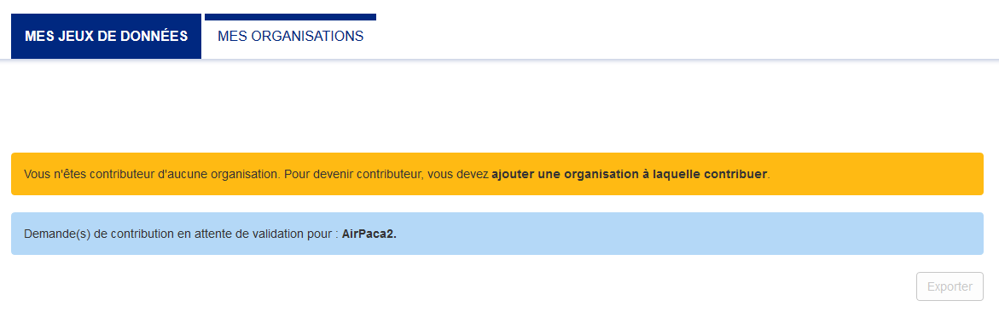
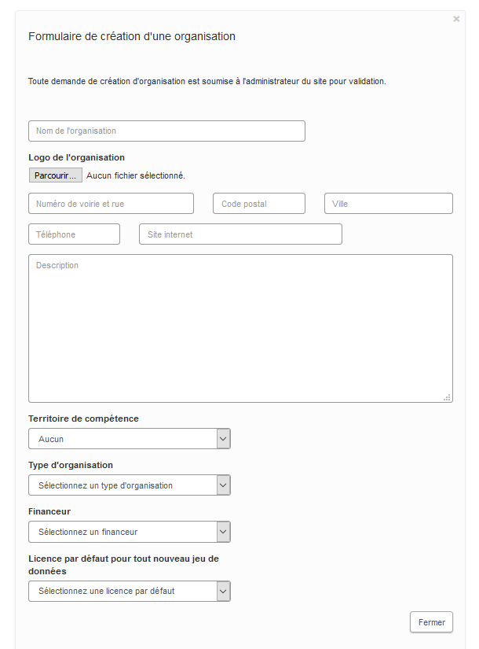
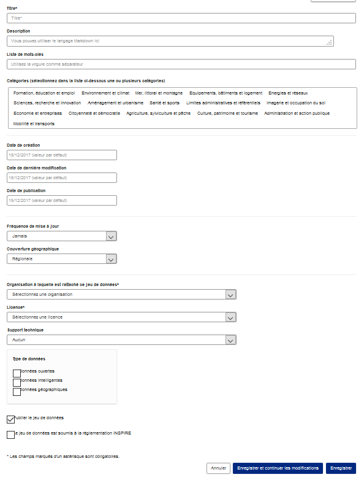

==================
Espace producteurs
==================

Ce guide est à destination des producteurs de données sur DataSud : http://publier-rec.datasud.fr 

---------------------------------
S'inscrire et publier sur DataSud
---------------------------------

.. note:: Toute personne, morale ou physique, publique ou privée, peut contribuer à la Plateforme, en publiant des jeux de données,  des textes, des ressources et des commentaires.

---------------------------------
Devenir Utilisateur
---------------------------------

- L’Utilisateur s’inscrit sur la Plateforme: https://publier-rec.datasud.fr
- Cette inscription est propre à sa personne et non à l’entité ou personne morale qu’il représente. 
- En s’inscrivant, l’Utilisateur crée un profil sur la Plateforme.
- En s'inscrivant, l'Utilisateur accepte les `« conditions d’utilisation » <https://www-rec.datasud.fr/conditions-dutilisation-cgus/>`_
- *Le nom d'utilisateur doit contenir uniquement des caractères alphanumériques en minuscules (ascii) et ces symboles : -_*
- l'Utilisateur doit ensuite valider son inscription en cliquant sur le lien reçu par mail.

.. image:: CaptureDataSudConnect.PNG

.. image:: CaptureDataSudSubscribe.PNG

.. note:: L’Utilisateur dispose des fonctionnalités suivantes ::

- créer ou rejoindre une Organisation, et en devenir Membre (voir rubrique dédiée),
- accéder aux données et services autorisés pour cette Organisation,
- accéder aux données et services autorisées pour les Utilisateurs inscrits,
- demander à devenir Contributeur d’une Organisation,
- suivre/s’abonner à un Jeu de données ou une Organisation ; le partage et l’intégration d’un Jeu de données ou d’une ressource directement sur un autre site.
- participer au contrôle de la qualité de la Plateforme en signalant les contenus n’ayant pas vocation à y figurer (illicites ou contraires aux CGU).
- contacter directement le Contributeur ayant publié un Jeu de données.
- contacter les Administrateurs de la Plateforme.

---------------------------------
Devenir Contributeur
---------------------------------

Les Utilisateurs peuvent créer ou rejoindre des Organisations. Il s’agit le plus souvent de personnes morales (autorités administratives, associations, entreprises) mais également de groupes informels.

Toute personne inscrite sur la plateforme en tant qu’Utilisateur peut demander et obtenir le statut de Contributeur pour une organisation existante ou une nouvelle organisation. 

.. note:: Le Contributeur dispose des fonctionnalités suivantes :

- publier un Jeu de données et y ajouter des Ressources, sous la forme d’un fichier téléchargeable, d’un lien ou d’une API,
- autoriser l’accès aux Ressources d’un Jeu de Données dont il est Contributeur à tous les Utilisateurs inscrits, à un Utilisateur, une Organisation ou uniquement l’Organisation propriétaire du Jeu de données.

.. note:: A noter ::

- La demande de **création d'une nouvelle organisation doit se faire au moment de l'inscription**.
- La demande de statut de Contributeur peut se faire au moment de l'inscription pour une nouvelle organisation ou après l'inscription sur une organisation existante.
- Pour retrouver ses organisations le Contributeur doit cliquer sur l'onglet *mes organisations* dans son espace d'administration. 
- Les demandes de statut sont soumis à la validation des Administrateurs *à priori*. Il faut donc patientier un peu. 

*Les Administrateurs de la Plateforme se réservent la possibilité de révoquer une inscription, un statut de Contributeur ou de Référent, sans avis préalable.*

---------------------------------
Devenir Référent
---------------------------------

Toute personne inscrite sur la plateforme en tant qu’Utilisateur peut demander et obtenir le statut de Référent pour une organisation.

.. note:: Le Référent dispose des fonctionnalités suivantes ::

- éditer ou supprimer un Jeu de Données publié par un Contributeur de l’Organisation dont il est Référent
- éditer ou supprimer un statut de Membre ou de Contributeur d’un Utilisateur d’une Organisation à laquelle il appartient

.. note:: A noter ::

- La demande de statut de Référent peut se faire au moment de l'inscription pour une nouvelle organisation ou après l'inscription sur une organisation existante.
- Pour retrouver ses organisations le Contributeur doit cliquer sur l'onglet *mes organisations* dans son espace d'administration. 
- Les demandes de statut sont soumis à la validation des Administrateurs *à priori*. Il faut donc patientier un peu. 

*Les Administrateurs de la Plateforme se réservent la possibilité de révoquer une inscription, un statut de Contributeur ou de Référent, sans avis préalable.*

.. image:: CaptureDataSudAddOrganizationStatus.PNG

- *>> Catalogue de données DataSud* https://trouver-rec.datasud.fr/dataset

- *>> Liste des contributeurs DataSud* https://trouver-rec.datasud.fr/organization

- *>> Liste des thématiques DataSud* https://trouver-rec.datasud.fr/group

----------------------------------------------
Renseigner les métadonnées
----------------------------------------------

Une fois connecté à l'espace d'administration le Contributeur et le Référent peuvent ajouter des Jeux de données à leurs Organisations.

.. note:: Les meta-données obligatoires sont les suivantes ::

- Titre
- Organisation
- Licence
- Dates (par défaut)

.. note:: Les meta-données facultatives sont les suivantes ::

- Descriptif
- Thématiques
- Mots-clés
- Type de données
- Meta-données INSPIRE
- Fréquence de mise à jour
- Couverture régionale

--------------------------------------------------
Datastore et données intelligentes
--------------------------------------------------

Datasud propose un **datastore**, c'est à dire un entrepôt de données qui offre un certain niveau de services dits "intelligents" sur les données (pour l'instant) tabulaires aux formats CSV et XLS. L'indexation de vos données dans le datastore permet notamment de transformer vos données en données semi-structurées et de :

- visualiser et parcourir ces dernières,
- les filtrer par champs.
- créer des datavisualisations simples,
- automatiser l'accès par [interface de programmation](http://datasud.readthedocs.io/fr/latest/developpeurs/services.html#service-api-ckan).

Permettre l'acccès à vos données dans un format semi-sructuré, ouvert et interprétable par une machine est une condition nécessaire pour industrialiser les usages qui peuvent être fait de vos données. C'est d'ailleurs une exigence de la loi république numérique. Le format CSV est le format pivot de Datasud.Fr pour transformées vos données tabulaires en données semi-structurées dites "intelligentes". 

**Dans la version bêta de DataSud cette mécanique est encore sensible.**

**Vos jeux de données doivent être préparés pour être proprement indexés dans le datastore :**

- Idéalement passer tous vos jeux de données en UTF-8. Notepad++ fait cela très bien.
- Idéalement exporter vos tableurs favoris (Microsoft, Libre et Open Office) au format CSV.
- Le format CSV à priviliégier doit être encoder en UTF-8 avec un ; séparateur / délimiteur.
- Avoir des titres de colonnes de moins de 62 caractères.
- En théorie les caractères spéciaux ('\:.,( -') sont acceptés. Les éviter dans les titres c'est beaucoup mieux.
- Harmoniser le type de vos données (et oui vos données sont typées) : en effet si une colonne ne comporte que des chiffres, le Datastore autodéterminera le type de cette colonne comme étant un nombre. Or si une valeur contient l'entrée N/A, le datastore va générer une erreur. Pour eviter les erreurs de type, une solution amont à l'indexation consiste à transformer toutes vos cellules en cellules au format TEXTE. Cela n'est pas satisfaisant, mais ca fonctionne.

Utilisez des outils appropriés pour nettoyer vos données :

- La méthode infolabs, produire un CSV de qualité : http://infolabs.io/prod-csv 
- Les outils http://csvlint.io/ https://goodtables.io/ ou http://openrefine.org/

**Attention :**

- EXCEL : seule la dernière feuille de calcul (ou onglet) est indexée dans le datastore. Il est donc nécessaire de déplacer la feuille de calcul qui contient les données que vous voulez indexer dans le datastore en dernière place de votre classeur.

- EXCEL : si vous ne voulez pas indexer vos données dans le datastore (pour plein de bonnes et mauvaises raisons), il suffit d'ajouter une feuille de calcul vide en dernière, à la fin du classeur. 

- ERREUR : En cas d'erreur supprimez complètement la ressource associée au jeu de données et ajoutez en une nouvelle.

--------------------------------------------------
Règles de nommage de vos ressources
--------------------------------------------------

Inspirer des recommandations en matière de nommage des fichiers électroniques et de plan de classement, nous vous proposons de respecter les règles suivantes relatives aux intitulés des ressources (fichiers) associées à vos jeux de données :

**- Le nom d’un fichier doit être succinct : éviter de dépasser 30 caractères (sans compter l’extension).
- Le nom d’un fichier doit être précis : il contiendra idéalement : le sujet, le type de document, la date de création, éventuellement la version.**

- Date: pour le 20 décembre 2016 => 20161220 (norme ISO 8601).
- Ne pas utiliser des mots vides : le, la, les, de, etc.
- Préférer le caractère _(underscore, tiret du 8) à un espace
- Eviter les lettres accentuées
- Le nom d’un fichier ne doit pas contenir : espace, ponctuation (sauf le point avant l’extension), caractères accentués ou spéciaux (ùé+’@à°[] :</* »& !$, etc.).
- La gestion des versions permet de suivre l’évolution et les étapes de l’élaboration d’un fichier. Il faut les distinguer soigneusement en les numérotant pour obtenir une suite logique exemple V01, V02, etc.

--------------------------------------------------
Amélioration des champs descriptifs avec Markdown
--------------------------------------------------

Pour les champs descriptifs de vos jeux de données et de vos ressources et de vos organisations vous pouvez utiliser la syntaxe Markdown.

Voici quelques exemples de syntaxe Markdown.

Cette liste n'est pas exhaustive.

=== Formatage ===

Mettre du texte en italique ::

    *quelques mots*

*quelques mots*

Mettre du texte en gras ::

    **plus important**

**plus important**

Pour mettre du code dans le texte::

    ``Mon code``

``Mon code``

=== Listes ===

Sauter une ligne avant le début de la liste.

Pour créer une liste non ordonnée ::

   * Pommes
   * Poires
   

* Pommes
* Poires  

=== Image ====

Vous pouvez afficher une image dans vos descriptifs. Attention, la taille n'est pas paramétrable et l'image doit déjà être disponible en ligne quelque part ::

   .. image:: CaptureDataSudConnect.PNG

.. image:: CaptureDataSudConnect.PNG

=== Liens ===

Pour créer des liens ::

   [texte du lien](url_du_lien "texte pour le titre, facultatif")
   https://trouver.datasud.fr (automatique si mon url commence par http ou https).

[Trouver des données sur Datasud.fr](https://trouver.datasud.fr)

 
=== Aller plus loin ===

https://fr.wikipedia.org/wiki/Markdown

https://guides.github.com/features/mastering-markdown/

https://guides.github.com/pdfs/markdown-cheatsheet-online.pdf

-------------------------------------------------------
Renseigner les métadonnées INSPIRE
-------------------------------------------------------

Cette partie de la documentation est en cours de rédaction.

