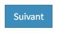

====================
Services de Datasud
====================

---------------------------------------------
Faire remonter vos données sur Data.Gouv.fr
---------------------------------------------

La Région et Etalab ont travaillé ensemble afin de permettre la remontée automatique des catalogues de données des contributeurs de DataSud vers la plateforme nationale https://www.data.gouv.fr/fr/. Cette mécanique est aussi appelée "moissonneur" ou "passerelle".

La procédure est relativemment simple. Il suffit de la mettre en place pour une organisation contributrice de DataSud afin que ses données soient ensuite synchronisées quotidiennement sur Data.Gouv.fr

**Chaque contributeur et organisation reste souverain pour mettre en place (ou non) une synchronisation de ses données vers DataGouv.**

**Quelques précisions :**

- Seules les **métadonnées** sont synchronisées sur DataGouv. Les données restent sur DataSud (ou ailleurs en fonction de vos choix en matière d'indexation de ressources).
- Le **moissonneur ne prend pas en compte la suppression** de jeux de données. Chaque contributeur doit supprimer ses jeux de données directement sur Data.Gouv.fr
- Un compte organisation sur DataGouv expose indifféremment les jeux de données créés manuellement sur Data.Gouv.fr et les jeux de données synchronisés automatiquement depuis DataSud. Faites ainsi bien attention aux doublons et à la cohérence des jeux de données.

**Mise en place de la procédure pour configurer votre moissonneur:**

**ETAPE 1:** Chaque contributeur crée une organisation sur Data.Gouv avec un compte utilisateur en son nom. `« INSCRIPTION sur DataGouv » <https://www.data.gouv.fr/fr/login?next=https%3A%2F%2Fwww.data.gouv.fr%2Ffr%2F>`_ 
- Ce compte utilisateur doit être administrateur de l'organisation.

**ETAPE 2: création d'un point de moissonnage sur DataGouv** L'administrateur de l'organisation sur Data.gouv.fr doit déclarer un point de moissonnage depuis l’interface d’administration DataGouv. 

- En haut à droite de votre espace d'administration DataGouv, cliquez sur **+** puis Un moissonneur.

.. image:: ajout_moissoneur.PNG

- Selectionner votre organisation "Publier en tant qu’organisation", 

.. image:: CaptureMoissonneur2.PNG

- cliquez sur Suivant en bas à droite de votre écran

- C'est ensuite ici que vous renseignez les informations techniques de votre moissonneur:

**Nom**: Il convient d'ajouter **Mon organisation - DataSud** à votre Nom afin que le service support de Data.gouv.fr puisse l'identifier plus facilement.

**URL** racine de l’instance CKAN : https://trouver.datasud.fr

**Implementation** Choisir ckan dans le menu déroulant

.. image:: ajout_nveau_moissoneur.PNG

.. Note:: Il est très important de ne pas oublier d'ajouter un filtre, au risque de moissonner tout DataSud::

**Filtres -> Inclure -> Organisation -> un nom d'organisation CKAN (ajouter l'identifiant de votre organisation dans DataSud)** 

Exemple : Pour filtrer les jeux de données de DLVA, il faudra préciser dans le nom d'organisation CKAN : **durance-luberon-verdon-agglomeration** 

.. image:: ajout_nveau_moissoneur_filtre.PNG

Cochez les cases **Actif** et **Archivage automatique** puis cliquez sur **ENREGISTRER**

**ETAPE 3:** Une fois créé, chaque contributeur **déclare son moissonneur aux administrateurs de DataSud en écrivant à datasud@maregionsud.fr**.

**ETAPE 4:** Etalab valide le moissonneur à la demande des administrateurs de DataSud.

**ETAPE 5:** La synchronisation du catalogue distant est faite une fois par jour (chaque nuit).

-------------------------
Utiliser le service MAJIC
-------------------------

Les données MAJIC 2021 sont disponibles au téléchargement pour les partenaires de la Région Provence-Alpes-Côte d’Azur sous réserve d’être ayants droit de la DGFIP.

Ce nouveau service prend en charge vos demandes de fichiers MAJIC depuis le mois de septembre 2021. 

**1. Les ayants droit**

L’accès aux fichiers littéraux est limité aux collectivités territoriales, aux administrations et aux organismes chargés d’une mission de service public. La seule exception concerne le fichier des voies et lieudits (fichier FANTOIR) qui est délivré gratuitement à tout demandeur. 

Les droits sont ouverts aux : 

* Collectivités territoriales : les communes, les Départements, la Région.
* Etablissements publics de coopération intercommunale : les syndicats de communes, les communautés de communes, les communautés urbaines, les communautés d'agglomération, les syndicats d'agglomération nouvelle et les métropoles.
* Administrations d’Etat : L'Etat est représenté par les services centraux ou territoriaux de ses administrations. À cette catégorie sont rattachées certaines autorités administratives indépendantes.
* Etablissements publics : La catégorie des établissements publics comprend les organismes et établissements de droit public, financés par des fonds publics, et dont la mission est de servir l'intérêt général. On distingue deux principales catégories d'établissements publics ( à caractère administratif ; à caractère industriel et commercial). 
* Etablissements publics administratifs : Ce sont des personnes morales de droit public gérant une activité de service public ou parapublic sous le contrôle de l'Etat ou d'une collectivité territoriale. 
Parmi les établissements publics administratifs susceptibles de commander des fichiers cadastraux, il convient de citer : 

-	les associations syndicales autorisées (ASA) et les associations syndicales constituées d'office (ASCO), 
-	l'institut national de l'information géographique et forestière (IGN), 
-	l'institut national de l’origine et de la qualité (INAO), 
-	le conservatoire du littoral, 
-	les services départementaux d'incendie et de secours (SDIS), 
-	le syndicat des transports d'Ile-de-France (STIF), 
-	les chambres de commerce et d'industrie (CCI). 
* Etablissements publics industriels et commerciaux : Ce sont des personnes morales de droit public gérant une activité de service public de nature industrielle ou commerciale selon les règles de gestion d'une entreprise privée industrielle ou commerciale. 

Parmi les établissements publics industriels ou commerciaux susceptibles de commander des fichiers cadastraux, il convient de citer : 

-	l'office national des forêts (ONF), 
-	le réseau ferré de France (RFF), 
-	la société nationale des chemins de fer français (SNCF), 
-	les offices publics de l'habitat (OPH). 
* Groupements d’intérêt public (GIP) ou Associations loi 1901 : Ce sont des personnes morales de droit public dont les membres exercent des activités d'intérêt général à but non lucratif. 
* Sociétés publiques locales d’aménagement (SPLA) : Les sociétés publiques locales d'aménagement ont été créées par la loi n° 2006-872 du 13 juillet 2006 portant engagement national pour le logement. Dans la mesure où le capital d'une SPLA est entièrement public, où son activité est réalisée intégralement pour le compte et uniquement sur le territoire des collectivités qui en sont actionnaires, et où ses statuts prévoient un contrôle suffisant pour que l'on puisse considérer que la personne publique délégante exerce sur la société un contrôle analogue à celui qu'il exerce sur ses propres services, la SPLA peut être considérée comme un tiers habilité à recevoir les données littérales de la DGFiP. 
* Prestataires de services : La restriction tenant à l'usage interne des données ne fait toutefois pas obstacle à une utilisation des données par un prestataire de services chargé de réaliser des traitements ou d'apporter son concours pour les études mises en œuvre par le demandeur. En cas de recours à un prestataire de services, une convention doit définir précisément les traitements qui lui sont demandés. Le prestataire doit prendre les mesures de sécurité nécessaires et s’engager à ce que les informations communiquées ne soient pas conservées, utilisées ou dupliquées à d’autres fins que celles indiquées par la convention. À l’issue de sa mission, il doit détruire tous les fichiers manuels ou informatisés servant de supports aux informations saisies. 

**2. Nature des documents délivrés** 

Les fichiers fonciers standards issus de l’application MAJIC comprennent : 

* Le fichier des propriétaires 
*	Le fichier des propriétés non bâties (parcelles) 
*	Le fichier des propriétés bâties (locaux) 
*	Le fichier des propriétés divisées en lots (lots de copropriété), complément des fichiers propriétés non bâties et bâties 
*	Le fichier des liens lots-locaux, complément du fichier propriétés bâties 

Ces fichiers produits une fois par an sont disponibles au début du deuxième semestre. Les données présentent la situation existante au 1er janvier de l’année. 
Depuis 2013, la livraison des fichiers MAJIC n’inclut plus les fichiers FANTOIR. Le fichier des voies et lieux-dits ou fichier FANTOIR est librement à disposition en téléchargement sur le site http://www.collectivites-locales.gouv.fr 
 
**3. Conditions d’obtention des fichiers** 

^^^^^^^^^^^^^^^^^^^^^^^^^^^^^^^^^^^^^^^^^^^^^^^^
*a. La procédure et l'instruction de la demande* 
^^^^^^^^^^^^^^^^^^^^^^^^^^^^^^^^^^^^^^^^^^^^^^^^

La Région Provence-Alpes-Côte d’Azur se conforme aux directives de la direction régionale des finances publiques. Elle doit analyser la finalité de la demande et s'assurer en particulier que les données ne seront pas utilisées dans un but commercial (actions de publicité ou de démarchage), électoral, ou politique (envois de tracts d'une organisation ou d'un parti politique). 
Elle pourra donc être amenée à effectuer des démarches d'éclaircissement auprès des demandeurs et, le cas échéant, à rejeter les demandes qui seraient manifestement incompatibles avec la législation. 

.. Note:: Prérequis obligatoires et règles : L’accès aux données est conditionné par l’inscription gratuite sur le portail www.datasud.fr de l’organisme demandeur, depuis un compte utilisateur nominatif et désigné comme référent de l’organisation. La demande d’accès aux données se fait ensuite depuis l’onglet « MAJIC » disponible sur le site dès que l’utilisateur référent est connecté.

Afin d’avoir accès aux données MAJIC, voici les étapes d’inscription :

**Etape 1** : Enregistrement de l’ayant droit sur www.datasud.fr (si ce n’est pas déjà fait)

* Inscrivez-vous sur datasud.fr en créant un compte nominatif ; 
*	Affectation du compte à une organisation déjà existante sur DataSud ou création d’un nouvel organisme ;
*	Désignation du compte nominatif comme étant référent de l’organisation car seule la personne désignée comme référente d'une organisation sera habilitée à télécharger les fichiers,
*	Votre organisme doit être un ayant droit sur les fichiers fonciers (cf. 1. Les ayants droit). Nous contacter si vous avez un doute

**Etape 2** : Activation de l’espace « MAJIC » 

Depuis l’onglet « MAJIC » du site datasud.fr, il faudra :

*	Vous devez prendre connaissance de la conformité des traitements avec le RGPD, ainsi que des procédures et contraintes applicables sur ces données : Procédure de mise à disposition des fichiers fonciers DGFiP procedure_mad_majic.pdf  [lien pdf] ;
*	Téléchargez l’acte d’engagement clause_confidentialite_majic_latest.pdf [lien pdf] à remplir et à signer et à nous transmettre via la boîte de dialogue dédiée ;
*	Transmettre les coordonnées du DPO de votre organisme (nom, prénom et mail). S’il n’y en n’a pas, votre organisme doit en nommer un et faire la déclaration sur https://www.cnil.fr/fr/designation-dpo ;
* le récépissé de la CNIL sera transmis depuis l’espace dédié de DataSUD. La livraison des données sera faite via la plateforme DataSUD dès validation de votre demande ;

**Etape 3** : Commande et téléchargement des fichiers 

Une fois l’espace « MAJIC » activé et les documents validés, vous pourrez, toujours depuis l’onglet « MAJIC » :

*	Visionner et vérifiez la validité du territoire concerné par votre organisme ;
*	Définir le type de lot souhaité, par commune ou par territoire ;
* Télécharger vos données depuis votre espace DataSUD : l’exécution de votre demande sera disponible quelques minutes plus tard. Attention, le lien pour télécharger les fichiers n’est valable que 2 heures.

^^^^^^^^^^^^^^^^^^^^^^^^^^^^^^
*b. Territoire de compétence* 
^^^^^^^^^^^^^^^^^^^^^^^^^^^^^^

La communication des données se limite à la compétence géographique et administrative du demandeur, qui doit les utiliser à des fins strictement internes. Il convient de réaliser un examen précis de la demande au regard de ces critères. 
Si un adhérent souhaite modifier son territoire de compétence, il doit fournir une preuve de l’évolution de ce dernier, en envoyant à la Région Provence-Alpes-Côte d’Azur un document officiel comprenant les codes INSEE des communes à ajouter et/ou enlever. 

^^^^^^^^^^^^^^^^^^^^^^^^^^^^^^^^^^^^^^^^^^^^^^^^^^^
*c. Contexte de la mise à disposition des fichiers* 
^^^^^^^^^^^^^^^^^^^^^^^^^^^^^^^^^^^^^^^^^^^^^^^^^^^

La Région Provence-Alpes-Côte d’Azur, avec l’accord de la DGFIP, s’engage à distribuer aux ayants-droit les fichiers fonciers standards issus de l’application Majic. 

^^^^^^^^^^^^^^^^^^^^^^^^^^^^^^^^^^^^^^^^^^^^^^^^^^^^^^^^^^^^^^^^^^^^^^^^^^^^^
*d. Conformité des traitements avec la loi informatique et libertés et RGPD* 
^^^^^^^^^^^^^^^^^^^^^^^^^^^^^^^^^^^^^^^^^^^^^^^^^^^^^^^^^^^^^^^^^^^^^^^^^^^^^

Il est précisé que la délibération CNIL n° 2012-088 du 29 mars 2012 dispense de déclaration les traitements automatisés de données personnelles mis en œuvre aux fins de consultation des données issues de la matrice cadastrale par toute commune, groupement et organisme privé ou public chargé d'une mission de service public (J.O. du 13 mai 2012) et exempte de toute obligation déclarative ces demandeurs tant pour les fichiers fonciers que pour les cédéroms VisuDGFiP cadastre. 
Le 28 mai 2018, la mise en place du Règlement Général sur la Protection des données (RGPD) rend obsolète l'obligation déclarative auprès de la CNIL des traitements informatisés de données à caractère personnel mis en œuvre dans le cadre d'un système d'information géographique via l’autorisation unique n°1 (AU-001). 
Dorénavant il revient à l’organisme ayant-droit et recevant les données des fichiers fonciers de se mettre en conformité lui-même aux nouvelles dispositions encadrant le RGPD. Pour cela, un DPO doit être déclaré auprès de la CNIL. Plus d’information sur https://www.cnil.fr/fr/designation-dpo. 

