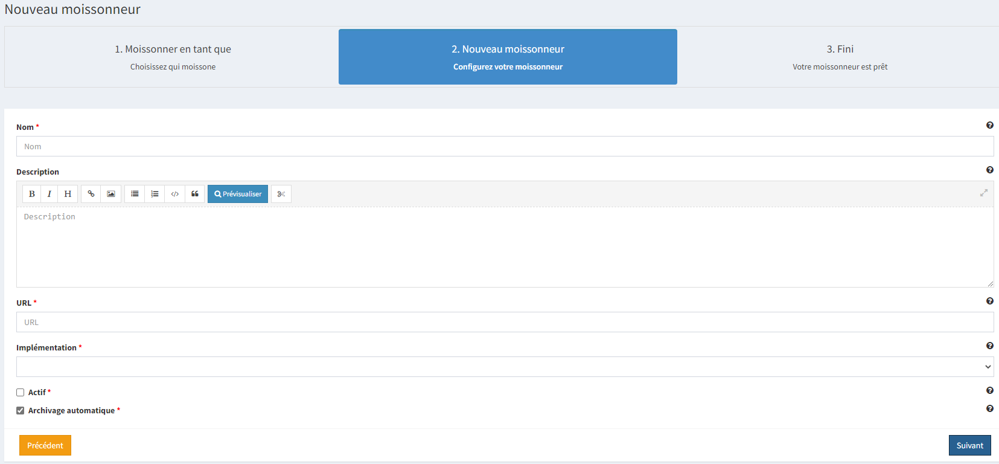
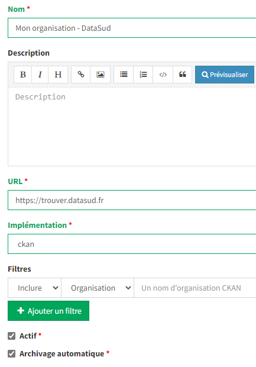

====================
Services de Datasud
====================

---------------------------------------------
Faire remonter vos données sur Data.Gouv.fr
---------------------------------------------

La Région et Etalab ont travaillé ensemble afin de permettre la remontée automatique des catalogues de données des contributeurs de DataSud vers la plateforme nationale https://www.data.gouv.fr/fr/. Cette mécanique est aussi appelée "moissonneur" ou "passerelle".

La procédure est relativemment simple. Il suffit de la mettre en place pour une organisation contributrice de DataSud afin que ses données soient ensuite synchronisées quotidiennement sur Data.Gouv.fr

**Chaque contributeur et organisation reste souverain pour mettre en place (ou non) une synchronisation de ses données vers DataGouv.**

**Quelques précisions :**

- Seules les **métadonnées** sont synchronisées sur DataGouv. Les données restent sur DataSud (ou ailleurs en fonction de vos choix en matière d'indexation de ressources).
- Le **moissonneur ne prend pas en compte la suppression** de jeux de données. Chaque contributeur doit supprimer ses jeux de données directement sur Data.Gouv.fr
- Un compte organisation sur DataGouv expose indifféremment les jeux de données créés manuellement sur Data.Gouv.fr et les jeux de données synchronisés automatiquement depuis DataSud. Faites ainsi bien attention aux doublons et à la cohérence des jeux de données.

**Mise en place de la procédure pour configurer votre moissonneur:**

**ETAPE 1:** Chaque contributeur crée une organisation sur Data.Gouv avec un compte utilisateur en son nom. `« INSCRIPTION sur DataGouv » <https://www.data.gouv.fr/fr/login?next=https%3A%2F%2Fwww.data.gouv.fr%2Ffr%2F>`_ 
- Ce compte utilisateur doit être administrateur de l'organisation.

**ETAPE 2: création d'un point de moissonnage sur DataGouv** L'administrateur de l'organisation sur Data.gouv.fr doit déclarer un point de moissonnage depuis l’interface d’administration DataGouv. 

- En haut à droite de votre espace d'administration DataGouv, cliquez sur **+** puis Un moissonneur.

.. image:: ajout_moissoneur.PNG

- Selectionner votre organisation "Publier en tant qu’organisation", 

.. image:: CaptureMoissonneur2.PNG

- cliquez sur Suivant en bas à droite de votre écran

.. image:: ajout_moissoneur_Suivant.PNG

- C'est ensuite ici que vous renseignez les informations techniques de votre moissonneur:

**Nom**: Il convient d'ajouter **Mon organisation - DataSud** à votre Nom afin que le service support de Data.gouv.fr puisse l'identifier plus facilement.

**URL** racine de l’instance CKAN : https://trouver.datasud.fr

**Implementation** Choisir ckan dans le menu déroulant

.. Note:: Il est très important de ne pas oublier d'ajouter un filtre, au risque de moissonner tout DataSud::

**Filtres -> Inclure -> Organisation -> un nom d'organisation CKAN (ajouter l'identifiant de votre organisation dans DataSud)** 

Exemple : Pour filtrer les jeux de données de DLVA, il faudra préciser dans le nom d'organisation CKAN : **durance-luberon-verdon-agglomeration** 

Cochez les cases **Actif** et **Archivage automatique** puis cliquez sur **ENREGISTRER**

**ETAPE 3:** Une fois créé, chaque contributeur **déclare son moissonneur aux administrateurs de DataSud en écrivant à datasud@maregionsud.fr**.

**ETAPE 4:** Etalab valide le moissonneur à la demande des administrateurs de DataSud.

**ETAPE 5:** La synchronisation du catalogue distant est faite une fois par jour (chaque nuit).
