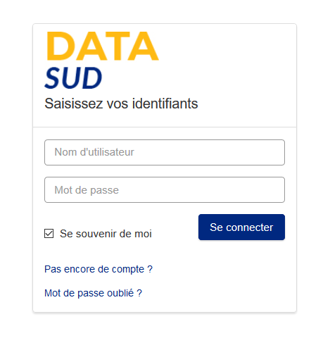
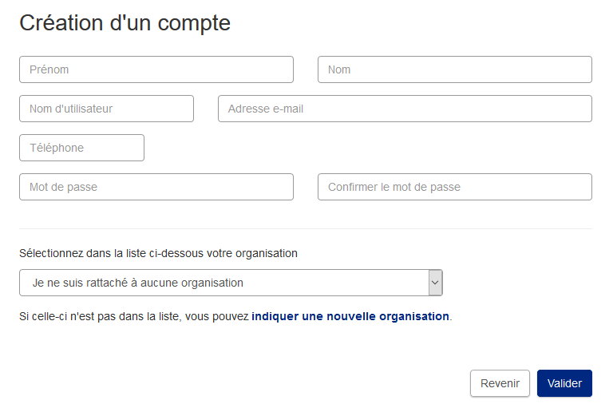
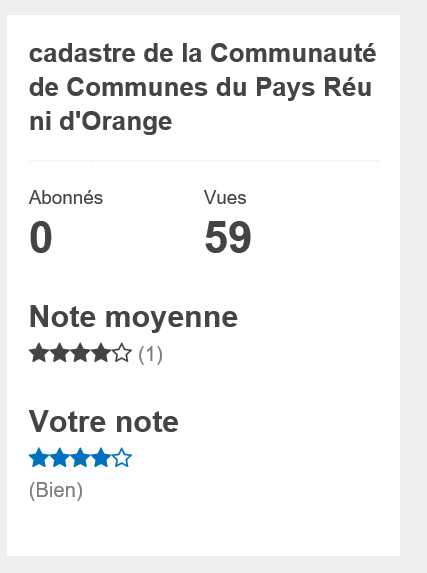
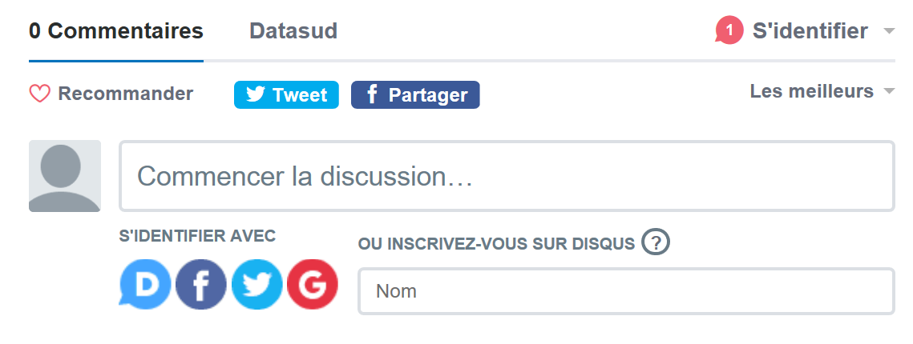

===================
Espace utilisateurs
===================

S'il n'est pas nécessaire de s'inscrire sur la plateforme pour consulter le catalogue et télécharger des données ouvertes, le fait de s'enregistrer sur DataSud https://publier.datasud.fr permet de disposer des fonctionnalités complémentaires par rapport à la consultation sans inscription.

.. note:: Toute personne, morale ou physique, publique ou privée, peut s'inscrire sur DataSud et ainsi contribuer à l'ouverture et la mise en commun des données publiques ou privées, en publiant des jeux de données, des textes, des ressources et des commentaires.

-------------------------------------------
S'inscrire sur DataSud 
-------------------------------------------

- L'utilisateur enregistre son identité qui est distincte de la personne morale qu'il représente.
- En s’inscrivant, l’Utilisateur crée un profil sur la Plateforme.
- En s'inscrivant, l'Utilisateur accepte les `« conditions d’utilisation » <https://www.datasud.fr/conditions-dutilisation/>`_

 .. note:: *Le nom d'utilisateur doit contenir uniquement des caractères alphanumériques en minuscules (ascii) et ces symboles : -_* 

- l'Utilisateur doit ensuite valider son inscription en cliquant sur le lien reçu par courriel, sur sa boite aux lettres de courrier electronique.
=======

-------------------------------------------
Participer à DataSud
-------------------------------------------

De nombreuses fonctionnalités participatives sont proposées :

- Faire une demande de donnée: https://www.datasud.fr/demande-de-donnees/
- Contacter les administrateurs de DataSud : https://www.datasud.fr/contactez-nous/
- Contacter directement le producteur ou le diffuseur d'un jeu de données
- Suivre/s’abonner à un jeu de données, une thématique ou une organisation,
- Noter la qualité d'un jeu de donnée,

- Demander l'accès aux administrateurs à des données réservées sur accès restreint,
- Accéder aux données et services autorisés pour une organisation.
- Commenter une organisation ou un jeu de données 

- Partager un jeu de données ou une ressource sur un autre site ou via des réseaux sociaux
- Déclarer une réutilisation : https://trouver.datasud.fr/showcase/new

- Participer au contrôle de la qualité de DataSud en signalant les contenus n’ayant pas vocation à y figurer (illicites ou contraires aux CGU).

- Créer une nouvelle Organisation ou demander à être rattaché à une Organisation existante (voir rubrique dédiée),
- Demander à devenir contributeur d’une organisation et éventuellement référent d’une organisation pour maitriser l'ensemble des publications de ladite organisation (voir rubrique dédiée). 
- Accéder à certaines fonctionnaltés de l'API nécessitant une clé d'authentification.
- Intégrer un catalogue de données en marque Blanche sur son propre site internet (Voir rubrique dédiée sur la marque blanche)
